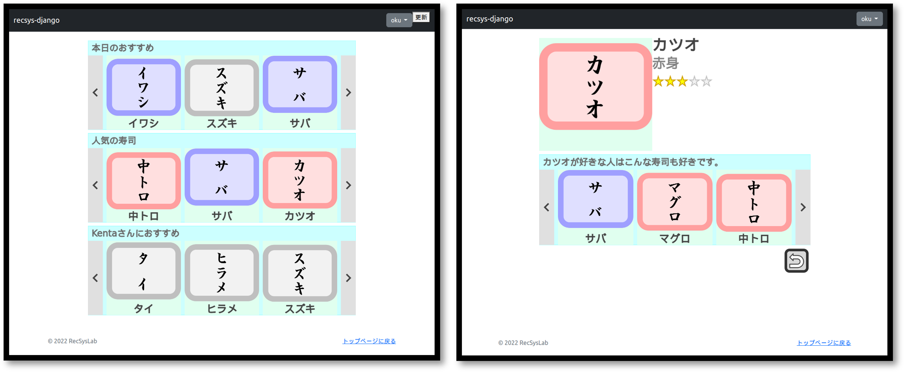



# recsys-django | Djangoによる推薦システム開発チュートリアル

## 概要

recsys-djangoはPythonのWebアプリケーションフレームワークであるDjangoによる推薦システム開発のチュートリアルです。

## 動機

研究室でDjangoを用いたWebアプリケーションの開発方法を学習してもらうために作成しました。個人での学習に加え、大学での授業や研究室等でご活用いただければ幸いです。

## 到達目標

- 推薦システムの実装の基本を修得できる。
- DjangoによるWebアプリケーション開発方法の基本を修得できる。
- 推薦システムに関わるデータベース設計の基本を修得できる。
- HTML5 CanvasとJavaScriptによるWebインタフェース設計の基本を修得できる。

## 取り組み方

下記の目次に記載している事前準備を行ったうえで、01から順にチュートリアルに取り組んでください。各ページでコード等を交えながら解説しています。適宜、参考文献も示していますので、併せて参照してください。チュートリアルどおりにコードを打ち込んでいくことで、**完成イメージ**に示すような推薦システムが完成します。

## 完成イメージ

- トップページにアクセスすることで、ランダム推薦システム、人気ベース推薦システム、アイテムベース協調フィルタリングによる3種類の推薦リスト（「本日のおすすめ」、「人気の寿司」、「〇〇さんにおすすめ」）が各推薦スロットに提示されます。
- 推薦スロットの左右のボタンをクリックすることで、推薦スロット内の提示アイテムを切り替えることができます。
- アイテムをクリックすることで、そのアイテムの詳細ページを閲覧することができます。
- アイテム詳細ページにおいて、「カツオが好きな人はこんな寿司も好きです」のように、アイテム類似度に基づく推薦リストが提示されます。
- ログインすることで、アイテム詳細ページにおいて、そのアイテムに対して評価値を付与することができます。
- 「更新」ボタンをクリックすることで、その時点の評価値行列に基づき推薦リストが更新されます。

## アレンジ
- 寿司のネタを増やす。
- 寿司の画像をフリー素材や自作のものに置き換える。
- 他の推薦システムを実装し、その推薦リストを提示する。
- インタフェースを改良する。
- 評価値行列を充実させる。
- タグを付与できるようにし、推薦に活用する。
- 寿司以外のドメインを対象にする。

## 動作確認

## 目次

### 事前準備
- [環境構築](setup.md)
- [PyCharmのインストールと設定](pycharm.md)

### プロジェクトの作成と初期設定
- [01 プロジェクトの作成](ja/01.md)
- [02 開発用Webサーバの起動](ja/02.md)
- [03 アプリケーションの作成](ja/03.md)
- [04 アプリケーションの登録](ja/04.md)
- [05 言語とタイムゾーンの設定](ja/05.md)

### データベース環境の構築と設定
- [06 データベース環境の構築](ja/06.md)
- [07 データベースの設定](ja/07.md)

### 認証用アプリケーション
- [08 認証用アプリケーションの作成と登録](ja/08.md)
- [09 カスタムユーザモデルの作成](ja/09.md)
- [10 マイグレーションの実行](ja/10.md)

### テーブル設計とモデル定義
- [11 ユーザ、アイテム、評価値テーブルの設計とデータの登録](ja/11.md)
- [12 推薦リストテーブルの設計とデータの登録](ja/12.md)
- [13 モデルの定義](ja/13.md)
- [14 クエリセットAPI](ja/14.md)

### ベーステンプレートとインデックスビュー
- [15 ベーステンプレートの作成](ja/15.md)
- [16 トップページの作成](ja/16.md)
- [17 インデックスビューの作成](ja/17.md)
- [18 URLディスパッチャ](ja/18.md)

### インタフェースと推薦リスト
- [19 キャンバスの実装](ja/19.md)
- [20 キャンバスへの描画](ja/20.md)
- [21 データベースからの推薦リストの取得](ja/21.md)
- [22 推薦スロットへの推薦リストの表示](ja/22.md)
- [23 キャンバスイベント処理の実装](ja/23.md)
- [24 さまざまな推薦システムによる推薦リストの取得](ja/24.md)
- [25 アイテム詳細ページの作成](ja/25.md)

### ログイン
- [26 管理サイト](ja/26.md)
- [27 ログイン機能の実装](ja/27.md)

### データベースへのデータの登録
- [28 データベースへのデータの登録](ja/28.md)

### オフライン処理
- [29 オフライン処理の実装](ja/29.md)

## 参考

## 作成者

龍谷大学 推薦システム研究室 奥 健太
