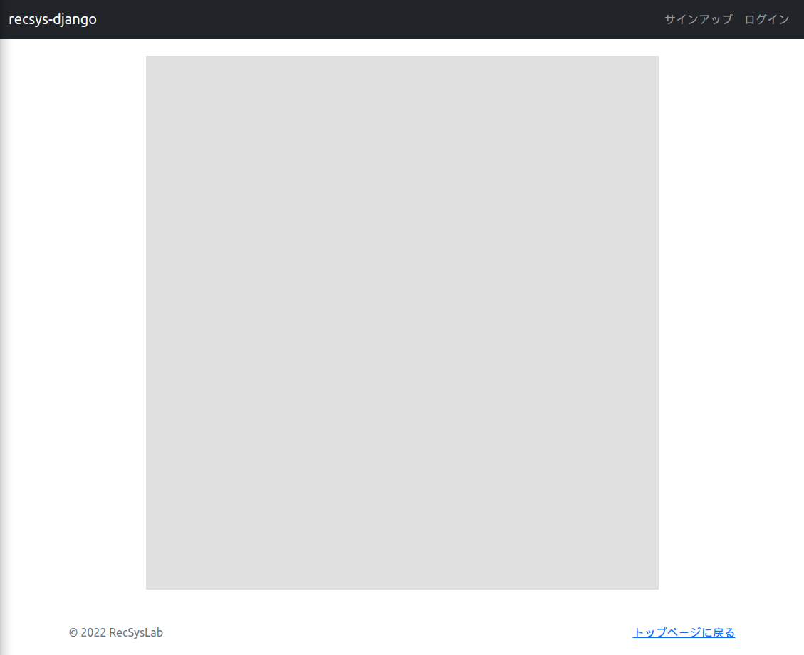





# キャンバスへの描画

ページが読み込まれたときに、キャンバス全体が薄いグレーで描画されるようにしてみましょう。`recsys_django/static/js/`ディレクトリに`main.js`、`Page.js`、`MainPage.js`を作成し、それぞれ下記のコードを記述してください。
 
リスト1: `recsys_django/static/js/main.js`
```js
/**
 * **** **** **** **** **** **** **** ****
 * 定数
 * **** **** **** **** **** **** **** ****
 */
/**
 * **** **** **** **** **** **** **** ****
 * グローバル変数
 * **** **** **** **** **** **** **** ****
 */
// ページ
let currentPage = null;         // 現在のページ
let mainPage = null;            // メインページ
/**
 * **** **** **** **** **** **** **** ****
 * 初期化処理
 * **** **** **** **** **** **** **** ****
 */
/**
 * ページ読込み
 */
$(function() {
    // 全体の初期化処理
    init();
});
/**
 * 全体の初期化処理
 */
function init() {
    // キャンバス要素の取得
    let canvas = $('#main_canvas').get(0);
    // 描画コンテキストの取得
    let context = canvas.getContext("2d");
    
    // ページの生成
    mainPage = new MainPage(canvas, context);

    // データの初期化
    initData();
}
/**
 * データの初期化
 */
function initData() {
    currentPage = mainPage;
    currentPage.draw();
}
/**
 * **** **** **** **** **** **** **** ****
 * ビュー関連
 * **** **** **** **** **** **** **** ****
 */
```

リスト2: `recsys_django/static/js/Page.js`
```js
/**
 * ページクラス
 */
class Page {
    /**
     * @param canvas    キャンバス要素
     * @param context   描画コンテキスト
     */
    constructor(canvas, context) {
        this.canvas = canvas;
        this.context = context;
    }
    /*
     * ページのクリックイベント
     * @param x x座標
     * @param y y座標
     */
    onClick(x, y) {
    }
    /*
     * ページのマウス移動イベント
     * @param x x座標
     * @param y y座標
     */
    onMouseMove(x, y) {
    }
    /*
     * ページの描画
     */
    draw() {
    }
}
```

リスト3: `recsys_django/static/js/MainPage.js`
```js
/**
 * メインページクラス
 */
class MainPage extends Page {
    /*
     * @override
     */
    constructor(canvas, context) {
        super(canvas, context);
    }
    /*
     * @override
     */
    onClick(x, y) {
    }
    /*
     * @override
     */
    onMouseMove(x, y) {
    }
    /*
     * @override
     */
    draw() {
        this.context.clearRect(0, 0, this.canvas.width, this.canvas.height);

        this.context.save();
        this.context.fillStyle = '#E0E0E0';
        this.context.fillRect(0, 0, this.canvas.width, this.canvas.height);
        this.context.restore();
    }
}
```

ここで、`main.js`の`定数`セクションおよび`グローバル変数`セクションには、それぞれ定数とグローバル変数の宣言を記述していくことにします。`初期化処理`セクションには、初期化に関わる処理を記述していきます。`ビュー関連`セクションには、キャンバスイベントなどインタフェースに関わる処理を記述していきます。作成した`main.js`、`Page.js`、`MainPage.js`を参照できるように、`index.html`の`{# --- js --- #}`の部分に下記のコードを追加してください。

リスト4: `recsys_django/online/templates/index.html`
```html
...（略）...
    {# --- js --- #}
    <script type="text/javascript" src=""></script>        <!-- 追加 -->
    <script type="text/javascript" src=""></script>    <!-- 追加 -->
    
    <script type="text/javascript" src=""></script>        <!-- 追加 -->


```

ブラウザで下記のURLにアクセスしてみましょう．

`http://localhost:8000/`



キャンバス全体が薄いグレーで表示されました。

それでは、ページが読み込まれてから、キャンバスが描画されるまでの流れを追ってみましょう。まず、このページ（`index.html`）が読み込まれたとき、`main.js`の`$(function() {...})`が呼ばれます。ここで、全体の初期化処理である`init()`関数を呼び出しています。

`init()`関数ではキャンバス要素を取得しています。キャンバス要素の取得には、jQueryのセレクタを用いて`$('#main_canvas').get(0)`とします。ここでは、`'#main_canvas'`を指定することで、`index.html`で作成したキャンバスを選択しています。取得したキャンバス要素を変数`canvas`に格納しています。

つづいて、キャンバス要素から描画用のコンテキストを取得しています。コンテキストの取得には、`canvas.getContext()`メソッドを用います。引数の`"2d"`は、2次元（2D）の描画用のメソッドを取得するという意味です。取得したコンテキストを変数`context`に格納しています。

次にページの生成です。本チュートリアルでは、トップページとしてメインページを表示し、アイテムがクリックされたときにその詳細ページに移動するような操作を想定しています。ページは`Page.js`の`Page`クラスで定義しています。`Page`クラスでは、ページのクリックイベントやマウス移動イベント、ページの描画などの処理を行うメソッドを用意しています。具体的なページはこの`Page`クラスを継承して定義します。メインページは`MainPage.js`の`MainPage`クラスで定義しています。`MainPage`クラスは`Page`クラスを継承しています。現時点では、ページの描画処理を行う`draw()`メソッドしか実装していません。`draw()`メソッドでは、単にキャンバス全体を薄いグレーで塗りつぶすように処理しています。

`Page`クラスと`MainPage`クラスを定義したところで、`main.js`からメインページを生成しましょう。`main.js`の`init()`関数の`mainPage = new MainPage(canvas, context);`でメインページを生成しています。ここで、`mainPage`はグローバル変数として宣言しています。

最後に、データの初期化を行う`initData()`関数を呼び出しています。この中で、グローバル変数である`currentPage`に先ほど生成した`mainPage`をセットすることで、現在のページをメインページとしています。そして、`currentPage.draw()`メソッドを呼び出すことで、メインページの描画を行っています。


