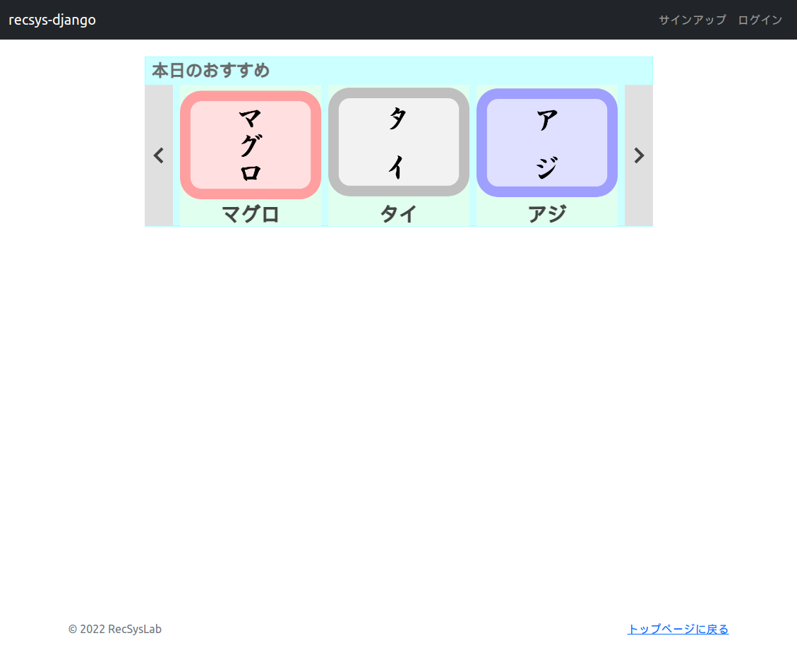





# 推薦スロットへの推薦リストの表示

前回は推薦リストをコンソールに出力するだけでした。今回は推薦リストをキャンバス上に視覚的に表示するようにしてみましょう。本チュートリアルでは、複数の推薦システムによる推薦リストを表示することを想定しています。推薦システムごとに推薦スロットを用意し、それぞれの推薦リストに対応する推薦システムによる推薦リストを表示するようにします。

まず、JavaScript上でアイテムの情報を管理するためにアイテムクラスを定義します。`recsys_django/static/js/`ディレクトリに`Item.js`を作成し、下記のコードを記述してください。

リスト1: `recsys_django/static/js/Item.js`
```js
/**
 * アイテムクラス
 */
class Item {
    /**
     * @param id        アイテムID
     * @param name      アイテム名
     * @param score     スコア
     */
    constructor(id, name, red, white, shining, score) {
        this.id = id;           // アイテムID
        this.name = name;       // アイテム名
        this.red = red;         // 赤身
        this.white = white;     // 白身
        this.shining = shining; // 光物
        this.score = score;     // スコア

        // アイテム画像
        this.image = new Image();
        this.image.src = 'media/items/item' + ('00' + this.id).slice(-2) + '.png';
        let src = this.image.src;
        this.image.onload = function() {
            console.log(src + " : load completed");
        }
    }
}
```

アイテムクラスにはアイテム画像オブジェクトももたせています。アイテムの画像を用意しておきましょう。下記のとおり、`recsys_django/`ディレクトリ直下に`media/items/`ディレクトリを作成してください。

- `recsys_django/media/items/`

このディレクトリ内にアイテムの画像を配置します。ここでは、アイテムID 1～9に対応した九つの画像`item01.png`～`item09.png`を用意します。[recsyslab/recsys-django/src/recsys_django/media/items/](https://github.com/recsyslab/recsys-django/tree/main/src/recsys_django/media/items)にアイテム画像のサンプルファイルを置いています。

`recsys_django/media/`ディレクトリにアクセスできるようにするため、下記のとおり`recsys_django/recsys_django/urls.py`にURLパターンを追加します。

リスト2: `recsys_django/recsys_django/urls.py`
```py
from django.contrib import admin
from django.urls import path, include
from django.conf import settings            # 追加
from django.conf.urls.static import static  # 追加

urlpatterns = [
    path('admin/', admin.site.urls),
    path('', include('online.urls')),
]

# 以下を追加
urlpatterns += static(
    # MEDIA_URL = 'media/'
    settings.MEDIA_URL,
    # MEDIA_ROOTにリダイレクト
    document_root=settings.MEDIA_ROOT
)
```

つづいて、キャンバス上でインタフェースを設計していきます。まず、レイアウト設計に関わる定数を定義します。`main.js`の`定数`セクションに下記のコードを追加してください。

リスト3: `recsys_django/static/js/main.js`
```
/**
 * **** **** **** **** **** **** **** ****
 * 定数
 * **** **** **** **** **** **** **** ****
 */
MARGIN = 10;

ITEM_COUNT = 9;
ITEM_WIDTH = 200;
ITEM_HEIGHT = 200;

NEXT_BUTTON_WIDTH = 40;
NEXT_BUTTON_HEIGHT = ITEM_HEIGHT;

SLOT_SIZE = 3;
SLOT_WIDTH = NEXT_BUTTON_WIDTH + MARGIN + (ITEM_WIDTH + MARGIN) * SLOT_SIZE + NEXT_BUTTON_WIDTH;
SLOT_HEIGHT = MARGIN * 4 + ITEM_HEIGHT;

MAIN_SLOT_COUNT = 3;
MAIN_SLOT_LEFT = 0;
MAIN_SLOT_TOP = 0;
MAIN_SLOT_RANDOM = 0;
MAIN_SLOT_POPULARITY = 1;
MAIN_SLOT_ITEMCF = 2;
```

キャンバス上に配置する部品はコンポーネントクラスとして定義しておきます。`recsys_django/static/js/`ディレクトリに`Component.js`を作成し、下記のコードを記述してください。

リスト4: `recsys_django/static/js/Component.js`
```
/**
 * コンポーネントクラス
 */
class Component {
    /**
     * @param left      コンポーネントの左端のx座標
     * @param top       コンポーネントの上端のy座標
     * @param width     コンポーネントの幅
     * @param height    コンポーネントの高さ
     */
    constructor(left, top, width, height) {
        this.left = left;           // コンポーネントの左端のx座標
        this.top = top;             // コンポーネントの上端のx座標
        this.width = width;         // コンポーネントの幅
        this.height = height;       // コンポーネントの高さ

        this.isActive = false;      // コンポーネントがアクティブか
    }
    /**
     * x, y座標がコンポーネントの範囲内か判定する。
     * @param x x座標
     * @param y y座標
     * @return  範囲内であればtrue、範囲外であればfalseを返す。
     */
    isWithin(x, y) {
        if (x < this.left || this.left + this.width < x) return false;
        if (y < this.top || this.top + this.height < y) return false;
        return true;
    }
    /**
     * コンポーネントを描画する。
     * @param context   描画コンテキスト
     */
    draw(context) {
    }
}
```

キャンバス上に表示する推薦スロットなどはこのコンポーネントクラスを継承したクラスとして定義します。`recsys_django/static/js/`ディレクトリに`ItemComponent.js`、`NextButton.js`、`Slot.js`を作成し、それぞれ下記のコードを記述してください。

リスト5: `recsys_django/static/js/ItemComponent.js`
```
/**
 * アイテムコンポーネントクラス
 */
class ItemComponent extends Component {
    /**
     * @param item      アイテム
     */
    constructor(left, top, width, height, item) {
        super(left, top, width, height);

        this.item = item;       // アイテム
    }
    /**
     * @override
     */
    draw(context) {
        // アイテム枠
        context.save();
        context.fillStyle = this.isActive == true ? '#B7FFDB' : '#E0FFEF';
        context.fillRect(this.left, this.top, this.width, this.height);
        context.restore();

        // アイテム画像
        context.save();
        let scale = this.width / this.item.image.width;
        let w = this.width;
        let h = this.item.image.height * scale;
        context.drawImage(this.item.image, this.left, this.top, w, h);
        context.restore();

        // アイテム名
        context.save();
        context.font = '28px メイリオ';
        context.fillStyle = '#434343';
        context.strokeStyle = '#434343';
        context.textBaseline = 'bottom';
        context.textAlign = 'center';
        context.fillText(this.item.name, this.left + this.width / 2, this.top + this.height);
        context.strokeText(this.item.name, this.left + this.width / 2, this.top + this.height);
        context.restore();
    }
}
```

リスト6: `recsys_django/static/js/NextButton.js`
```
/**
 * 「次へ」ボタンクラス
 */
class NextButton extends Component {
    /**
     * @param direction 矢印の向き
     */
    constructor(left, top, width, height, direction) {
        super(left, top, width, height);

        this.direction = direction;     // 矢印の向き
    }
    /**
     * @override
     */
    draw(context) {
        // ボタン枠
        context.save();
        context.fillStyle = this.isActive == true ? '#C0C0C0' : '#E0E0E0';
        context.fillRect(this.left, this.top, this.width, this.height);
        context.restore();

        // 矢印
        context.save();
        context.strokeStyle = '#434343';
        context.lineWidth = 4;
        context.beginPath();
        context.moveTo(this.left + this.width / 2 - 5 * this.direction, this.top + this.height / 2 - 10);
        context.lineTo(this.left + this.width / 2 + 5 * this.direction, this.top + this.height / 2);
        context.lineTo(this.left + this.width / 2 - 5 * this.direction, this.top + this.height / 2 + 10);
        context.stroke();
        context.restore();
    }
}
```

リスト7: `recsys_django/static/js/Slot.js`
```
/**
 * 推薦スロットクラス
 */
class Slot extends Component {
    /**
     * @param size      推薦スロットサイズ
     */
    constructor(left, top, width, height, size) {
        super(left, top, width, height);

        this.description = null;    // 説明文
        this.items = null;          // 推薦リストに含まれるアイテム配列
        this.max = -1;              // 推薦リストに含まれるアイテム数

        this.size = size;           // 推薦スロットサイズ（表示されるアイテム数）
        this.itemComponents = null; // 推薦スロットに含まれるアイテムコンポーネント配列
        this.current = 0;           // 推薦スロット内での現在の表示位置

        // 「前へ」ボタン
        this.prevButton = new NextButton(this.left, this.top + MARGIN * 4, NEXT_BUTTON_WIDTH, NEXT_BUTTON_HEIGHT, -1);
        // 「次へ」ボタン
        this.nextButton = new NextButton(this.left + this.width - NEXT_BUTTON_WIDTH, this.top + MARGIN * 4, NEXT_BUTTON_WIDTH, NEXT_BUTTON_HEIGHT, +1);
    }
    /*
     * @override
     */
     draw(context) {
        if (!this.isActive) return;

        // 推薦スロット枠
        context.save();
        context.fillStyle = '#CCFFFF';
        context.strokeStyle = '#7FFFFF';
        context.fillRect(this.left, this.top, this.width, this.height);
        context.strokeRect(this.left, this.top, this.width, this.height);
        context.restore();

        // 推薦スロットの説明文
        context.save();
        context.font = '24px メイリオ';
        context.fillStyle = 'dimgray';
        context.strokeStyle = 'dimgray';
        context.textBaseline = 'top';
        context.textAlign = 'left';
        context.fillText(this.description, this.left + MARGIN, this.top + MARGIN);
        context.strokeText(this.description, this.left + MARGIN, this.top + MARGIN);
        context.restore();

        // 推薦スロット内に表示するアイテム
        for (let i = 0; i < this.size; i++) {
            if (this.itemComponents[i] == null) continue;
            this.itemComponents[i].draw(context);
        }

        // 「前へ」「次へ」ボタン
        this.prevButton.draw(context);
        this.nextButton.draw(context);
    }
    /*
     * 推薦スロット内に表示するアイテムをセットする。
     */
    setItems() {
        this.itemComponents = new Array(this.size);
        for (let i = 0; i < this.size; i++) {
            if (this.items.length < i + 1) break;
            let left = this.left + MARGIN + this.prevButton.width + (ITEM_WIDTH + MARGIN) * i;
            let top = this.top + MARGIN * 4;
            let item = this.items[(this.current + i) % this.max];
            this.itemComponents[i] = new ItemComponent(left, top, ITEM_WIDTH, ITEM_HEIGHT, item);
        }
    }
    /**
     * 推薦スロットに推薦リストをセットする。
     * @param description   説明文
     * @param reclist       推薦リスト
     */
    setRecList(description, reclist) {
        this.description = description;
        this.max = reclist.length;

        // 推薦リストに含まれるアイテム配列
        this.items = new Array(this.max);
        for (let i = 0; i < this.max; i++) {
            let item = reclist[i].item;
            let score = reclist[i].score;
            this.items[i] = new Item(item.item_id, item.name, item.red, item.white, item.shining, score);
        }

        this.setItems();
    }
    /**
     * スロットの表示位置を一つ進める。
     */
    next() {
        this.current += 1;
        if (this.current >= this.max) {
            this.current = 0;
        }
        this.setItems();
    }
    /**
     * スロットの表示位置を一つ戻す。
     */
    prev() {
        this.current -= 1;
        if (this.current < 0) {
            this.current = this.max - 1;
        }
        this.setItems();
    }
    /**
     * 点(x, y)上のアイテムを取得する。
     * @param x x座標
     * @param y y座標
     * @return  アイテム
     */
    getItemOn(x, y) {
        if (super.isWithin(x, y) == false) return null;

        for (let i = 0; i < this.size; i++) {
            if (this.itemComponents[i] == null) continue;
            if (this.itemComponents[i].isWithin(x, y)) {
                return this.itemComponents[i];
            }
        }
        return null;
    }
}
```

作成した`Item.js`、`Component.js`、`ItemComponent.js`、`NextButton.js`、`Slot.js`を参照できるように、`index.html`の`{# --- js --- #}`の部分に下記のコードを追加してください。

リスト8: `recsys_django/online/templates/index.html`
```html
...（略）...
    {# --- js --- #}
    <script type="text/javascript" src=""></script>
    <script type="text/javascript" src=""></script>
    
    <script type="text/javascript" src=""></script>            <!-- 追加 -->

    <script type="text/javascript" src=""></script>       <!-- 追加 -->
    <script type="text/javascript" src=""></script>   <!-- 追加 -->
    <script type="text/javascript" src=""></script>      <!-- 追加 -->
    <script type="text/javascript" src=""></script>            <!-- 追加 -->

    <script type="text/javascript" src=""></script>


```

最後に、`MainPage`クラスの`getRandomRecommendations()`メソッドで取得された推薦リストを推薦スロットに表示するようにします。`MainPage.js`のコードを下記のように修正、追加してください。

リスト9: `recsys_django/static/js/MainPage.js`
```
/**
 * メインページクラス
 */
class MainPage extends Page {
    /*
     * @override
     */
    constructor(canvas, context) {
        super(canvas, context);

        /* 以下を追加 */
        // 推薦スロット配列
        this.slots = new Array(MAIN_SLOT_COUNT);
        for (let i = 0; i < this.slots.length; i++) {
            this.slots[i] = new Slot(MAIN_SLOT_LEFT, MAIN_SLOT_TOP + (SLOT_HEIGHT + MARGIN) * i, SLOT_WIDTH, SLOT_HEIGHT, SLOT_SIZE);
        }
    }
...（略）...
    /*
     * @override
     */
    draw() {
        this.context.clearRect(0, 0, this.canvas.width, this.canvas.height);

        /* 以下に修正 */
        // 推薦スロット配列
        for (let i = 0; i < this.slots.length; i++) {
            this.slots[i].draw(this.context);
        }
    }
    /**
     * ランダム推薦システムによる推薦リストを取得する。
     */
    getRandomRecommendations() {
        let thisPage = this;
        $.ajax({
            url: 'random/',
            method: 'GET',
            data: {
            },
            timeout: 10000,
            dataType: "json",
        }).done(function(response) {
            let description = response.description;
            let reclist = response.reclist;
            /* 以下に修正 */
            thisPage.slots[MAIN_SLOT_RANDOM].isActive = true;
            thisPage.slots[MAIN_SLOT_RANDOM].setRecList(description, reclist);
            thisPage.draw();
        }).fail(function(response) {
            window.alert('MainPage::getRandomRecommendations() : failed');
        });
    }
}
```

ブラウザで下記のURLにアクセスしてみましょう。

`http://localhost:8000/`

すると、下図のように、ランダム推薦システムによる推薦リストが、「本日のおすすめ」という推薦説明文と共に推薦スロット上に表示されました。



本来であれば、推薦リストには9件のアイテムすべての情報が格納されており、推薦スロットの左右のボタンをクリックすることで表示されるアイテムを切り替えることができますが、クリックイベントの処理についてはまだ実装していませんので、現時点では、推薦スロット上をクリックしても何も反応しません。次回は、クリックイベント処理を実装しましょう。


