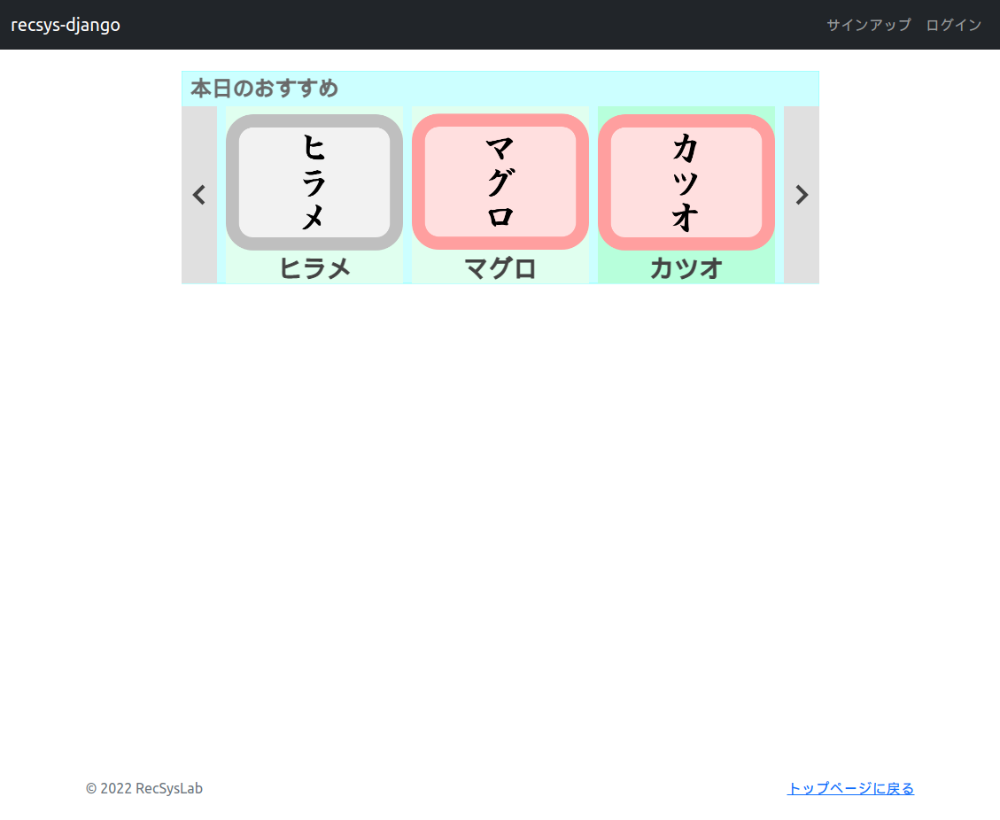





# キャンバスイベント処理の実装

キャンバス上でマウスを動かしたり、クリックしたりしたときにはキャンバスイベントが発生します。イベントが発生するとイベントリスナでイベントに対して紐付けられたイベントハンドラが呼び出されます。イベントハンドラに処理を記述することで、イベント発生時の処理を実行させることができます。ここでは、キャンバスへのマウスクリックイベントとキャンバス上のマウス移動イベントを実装しましょう。

まず、`main.js`の`ビュー関連`セクションに下記のコードを追加してください。

リスト1: `recsys_django/static/js/main.js`
```js
/**
 * **** **** **** **** **** **** **** ****
 * ビュー関連
 * **** **** **** **** **** **** **** ****
 */
/**
 * ウィンドウ座標からキャンバス座標に変換する。
 * @param canvas    キャンバス要素
 * @param wx        ウィンドウ上のx座標
 * @param wy        ウィンドウ上のy座標
 * @return          キャンバス座標
 */
function windowToCanvas(canvas, wx, wy) {
	let bbox = canvas.getBoundingClientRect();
	return {
		x: (wx - bbox.left) * (canvas.width / bbox.width),
		y: (wy - bbox.top)  * (canvas.height / bbox.height)
	};
}
/**
 * キャンバスへのマウスクリック
 */
function onCanvasClick(e) {
    let loc = windowToCanvas(currentPage.canvas, e.clientX, e.clientY);

    if (currentPage == null) return;
    currentPage.onClick(loc.x, loc.y);
    currentPage.draw();
}
/**
 * キャンバス上のマウス移動
 */
function onCanvasMouseMove(e) {
    let loc = windowToCanvas(currentPage.canvas, e.clientX, e.clientY);

    currentPage.canvas.style = 'cursor: default';

    if (currentPage == null) return;
    currentPage.onMouseMove(loc.x, loc.y);
    currentPage.draw();
}
```

ビュー関連の関数として、`windowToCanvas()`関数、`onCanvasClick()`関数、`onCanvasMouseMove()`関数を定義しています。

つづいて、`main.js`の`init()`関数に下記コードを追加してください。

リスト2: `recsys_django/static/js/main.js`
```js
/**
 * 全体の初期化処理
 */
function init() {
    // キャンバス要素の取得
    let canvas = $('#main_canvas').get(0);
    // 描画コンテキストの取得
    let context = canvas.getContext("2d");
    
    /* 以下を追加 */
    // イベントリスナの追加
    canvas.addEventListener('click', onCanvasClick, false);
    canvas.addEventListener('mousemove', onCanvasMouseMove, false);

    // ページの生成
    mainPage = new MainPage(canvas, context);

    // データの初期化
    initData();
}
```

そして、`MainPage.js`の`MainPage`クラスに下記のメソッドを追加してください。

リスト3: `recsys_django/static/js/MainPage.js`
```js
    /*
     * @override
     */
    onClick(x, y) {
        // 各推薦スロット内のボタンクリックの判定
        for (let i = 0; i < this.slots.length; i++) {
            if (this.slots[i].prevButton.isWithin(x, y)) {
                // 「前へ」ボタン
                this.slots[i].prev();
                return;
            } else if (this.slots[i].nextButton.isWithin(x, y)) {
                // 「次へ」ボタン
                this.slots[i].next();
                return;
            }
        }

        // 各推薦スロット内のアイテムクリックの判定
        for (let i = 0; i < this.slots.length; i++) {
            let itemComponent = this.slots[i].getItemOn(x, y);
            if (itemComponent == null) continue;
            currentPage = detailPage;
            detailPage.open(itemComponent.item);
            return;
        }
    }
    /*
     * @override
     */
    onMouseMove(x, y) {
        // 各状態の初期化
        for (let i = 0; i < this.slots.length; i++) {
            this.slots[i].prevButton.isActive = false;
            this.slots[i].nextButton.isActive = false;

            for (let j = 0; j < this.slots[i].size; j++) {
                if (!this.slots[i].isActive) continue;
                let itemComponent = this.slots[i].itemComponents[j];
                itemComponent.isActive = false;
            }
        }

        // 各推薦スロット内のボタン上のマウス移動の判定
        for (let i = 0; i < this.slots.length; i++) {
            if (this.slots[i].prevButton.isWithin(x, y)) {
                this.canvas.style = 'cursor: pointer';
                this.slots[i].prevButton.isActive = true;
                return;
            } else if (this.slots[i].nextButton.isWithin(x, y)) {
                this.canvas.style = 'cursor: pointer';
                this.slots[i].nextButton.isActive = true;
                return;
            }
        }

        // 各推薦スロット内のアイテム上のマウス移動の判定
        for (let i = 0; i < this.slots.length; i++) {
            if (!this.slots[i].isActive) continue;
            let itemComponent = this.slots[i].getItemOn(x, y);
            if (itemComponent != null) {
                this.canvas.style = 'cursor: pointer';
                itemComponent.isActive = true;
                return;
            }
        }
    }
```

ブラウザで下記のURLにアクセスしてみましょう。

`http://localhost:8000/`



推薦スロット上の左右のボタンやアイテム上にマウスカーソルを移動させると、それぞれがハイライト表示されます。例えば、上図では「カツオ」の上にマウスカーソルを移動させた状態です。「カツオ」の周辺がハイライト表示されています。また、左右のボタンをクリックすると、推薦スロット上のアイテムの表示が切り替わります。

処理の流れをみていきましょう。まず、リスト1の`onCanvasClick()`関数がキャンバスへのマウスクリックに対応したイベントハンドラになります。つづいて、マウスクリックイベントとこの関数を紐づける必要があります。その役割を担うのがイベントリスナです。リスト2のように`init()`関数に`canvas.addEventListener()`メソッドを追加しています。このメソッドの第1引数には対象とするイベントの種類を指定します。ここでは、`'click'`としていますのでクリックイベントを表しています。第2引数にはこのイベントに紐づける関数を指定しています。ここでは、`onCnavasClick`としていますので、先ほど定義した`onCnavasClick()`関数が紐づけられます。第3引数にはオプションを指定することができるのですが、今回は何も指定しませんので`false`としています。

これで、キャンバス上をクリックすると`onCanvasClick()`関数が呼ばれることになります。`onCanvasClick()`関数の引数`e`には、マウスがクリックされた座標などのイベントに関する情報が格納されています。

`onCnavasClick()`関数では、`currentPage.onClick()`メソッドを呼び出しています。つまり、現在のページに割り付けられているページクラスの`onClick()`メソッドを呼び出します。現在はメインページが割り付けられていますので、`MainPage`クラスの`onClick()`メソッドが呼び出されることになります。ただし、ウィンドウ上の座標とキャンバス上の座標は異なります。リスト1の`windowToCanvas()`関数は、ウィンドウ座標からキャンバス座標に変換する関数です。`windowToCanvas()`関数の引数にウィンドウ座標のx座標、y座標を与えると、キャンバス座標に変換されたx座標、y座標が返されます。このキャンバス座標に変換されたx座標、y座標をページクラスの`onClick()`メソッドに渡します。

`MainPage`クラスの`onClick()`メソッドでは、引数に受け取ったx座標、y座標が推薦スロット内のボタンの範囲内か判定したうえで、範囲内であれば推薦スロットの表示位置を一つ進めたり、戻したりする処理として、推薦スロットクラスの`next()`メソッドや`prev()`メソッドを呼び出しています。

マウス移動イベントについても同様です。リスト1の`onCanvasMouseMove()`関数がキャンバス上のマウス移動に対応したイベントハンドラになります。それに対応するイベントリスナは、リスト2のように`init()`関数の`canvas.addEventListener()`メソッドの第1引数に`'mousemove'`と指定することで定義しています。


