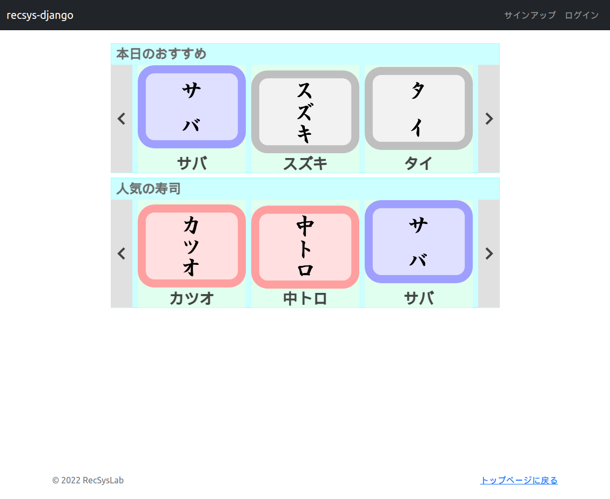





# さまざまな推薦システムによる推薦リストの取得

これまではランダム推薦システムによる推薦リストの取得のみ実装してきましたが、ここでは他のさまざまな推薦システムによる推薦リストの取得についても実装してみましょう。本チュートリアルでは、推薦システムとして、人気ベース推薦システム、アイテム類似度ベース推薦システム、アイテムベース協調フィルタリングを実装します。メインページには、既に実装したランダム推薦システムに加え、人気ベース推薦システム、アイテムベース協調フィルタリングによる推薦リストを、それぞれ対応する推薦スロットに表示することにします。アイテム類似度ベース推薦システムは、後に実装するアイテムの詳細ページで表示することにします。

まず、`MainPage.js`に人気ベース推薦システム、アイテムベース協調フィルタリング、それぞれによる推薦リストを取得するためのメソッドとして、`getPopularityBasedRecommendations()`メソッドと`getItemcfBasedRecommendations()`メソッドを追加します。


リスト1: `recsys_django/static/js/MainPage.js`
```js
    /**
     * 人気ベース推薦システムによる推薦リストを取得する。
     */
    getPopularityBasedRecommendations() {
        let thisPage = this;
        $.ajax({
            url: 'popularity/',
            method: 'GET',
            data: {
            },
            timeout: 10000,
            dataType: "json",
        }).done(function(response) {
            let description = response.description;
            let reclist = response.reclist;
            thisPage.slots[MAIN_SLOT_POPULARITY].isActive = true;
            thisPage.slots[MAIN_SLOT_POPULARITY].setRecList(description, reclist);
            thisPage.draw();
        }).fail(function(response) {
            window.alert('MainPage::getPopularityBasedRecommendations() : failed');
        });
    }
    /**
     * アイテムベース協調フィルタリングによる推薦リストを取得する。
     */
    getItemcfBasedRecommendations() {
        let thisPage = this;
        $.ajax({
            url: 'itemcf/',
            method: 'GET',
            data: {
            },
            timeout: 10000,
            dataType: "json",
        }).done(function(response) {
            let description = response.description;
            let reclist = response.reclist;
            if (reclist == null) return;
            if (reclist.length <= 0) return;
            thisPage.slots[MAIN_SLOT_ITEMCF].isActive = true;
            thisPage.slots[MAIN_SLOT_ITEMCF].setRecList(description, reclist);
            thisPage.draw();
        }).fail(function(response) {
            window.alert('MainPage::getItemcfBasedRecommendations() : failed');
        });
    }
```

つづいて、`online/views.py`に、人気ベース推薦ビュー`PopularityView`クラス、アイテム類似度ベース推薦ビュー`SimilarityView`クラス、アイテムベース協調フィルタリングビュー`ItemcfView`クラスを定義します。それぞれ、下記のコードを追加してください。

リスト2: `recsys_django/online/views.py`
```py
import json

from django.views.generic import View
from django.shortcuts import render
from django.http import HttpResponse

# ReclistPopularity, ReclistSimilarity, ReclistItemcfを追加
from .models import Item, ReclistPopularity, ReclistSimilarity, ReclistItemcf
# RecPopularityMapper, RecSimilarityMapper, RecItemcfMapperを追加
from .mappers import RecRandomMapper, RecPopularityMapper, RecSimilarityMapper, RecItemcfMapper
...（略）...
class PopularityView(View):
    """人気ベース推薦ビュー
    """

    def get(self, request, *args, **kwargs):
        """人気ベース推薦リストを取得する。

        Parameters
        ----------
        request : WSGIRequest
            リクエスト

        Returns
        -------
        HttpResponse
            推薦説明と推薦リストをJSON形式で返す。
        """
        # オブジェクトの取得
        reclist = ReclistPopularity.objects.all()
        recs = [RecPopularityMapper(rec).as_dict() for rec in reclist]

        # レスポンスの生成
        description = '人気の寿司'
        response = {
            'description': description,
            'reclist': recs,
        }
        response_json = json.dumps(response)

        # レスポンスの返却
        return HttpResponse(response_json, content_type='application/json')


class SimilarityView(View):
    """アイテム類似度ベース推薦ビュー
    """

    def get(self, request, item_id, *args, **kwargs):
        """アイテム類似度ベース推薦リストを取得する。

        Parameters
        ----------
        request : WSGIRequest
            リクエスト
        item_id : int
            ベースアイテムのアイテムID

        Returns
        -------
        HttpResponse
            推薦説明と推薦リストをJSON形式で返す。
        """
        # オブジェクトの取得
        base_item = Item.objects.get(pk=item_id)
        reclist = ReclistSimilarity.objects.filter(base_item_id=item_id)
        recs = [RecSimilarityMapper(rec).as_dict() for rec in reclist]

        # レスポンスの生成
        description = base_item.name + 'が好きな人はこんな寿司も好きです。'
        response = {
            'description': description,
            'reclist': recs,
        }
        response_json = json.dumps(response)

        # レスポンスの返却
        return HttpResponse(response_json, content_type='application/json')


class ItemcfView(View):
    """アイテムベース協調フィルタリングビュー
    """

    def get(self, request, *args, **kwargs):
        """アイテムベース協調フィルタリングによる推薦リストを取得する。

        Parameters
        ----------
        request : WSGIRequest
            リクエスト

        Returns
        -------
        HttpResponse
            推薦説明と推薦リストをJSON形式で返す。
        """
        if not request.user.is_authenticated:
            # 対象ユーザがログイン状態でない場合
            response = {
                'description': None,
            }
            response_json = json.dumps(response)
            return HttpResponse(response_json, content_type='application/json')

        # オブジェクトの取得
        user = request.user.user
        # オブジェクトの取得
        reclist = ReclistItemcf.objects.filter(user_id=user.user_id)
        recs = [RecItemcfMapper(rec).as_dict() for rec in reclist]

        # レスポンスの生成
        description = user.name + 'さんにおすすめ'
        response = {
            'description': description,
            'reclist': recs,
        }
        response_json = json.dumps(response)

        # レスポンスの返却
        return HttpResponse(response_json, content_type='application/json')
```

また、それぞれに対応するマッパーとして、人気ベース推薦マッパー`RecPopularityMapper`クラス、アイテム類似度ベース推薦マッパー`RecSimilarityMapper`クラス、アイテムベース協調フィルタリングによる推薦マッパー`RecItemcfMapper`クラスを定義します。`online/mappers.py`に下記のコードを追加してください。

リスト3: `recsys_django/online/mappers.py`
```py
class RecPopularityMapper:
    """人気ベース推薦マッパー

    Attributes
    ----------
    rec : ReclistPopularity
        推薦オブジェクト
    """

    def __init__(self, rec):
        self.rec = rec

    def as_dict(self):
        """推薦オジェクトを辞書型として取得する。

        Returns
        -------
        dict
            推薦オブジェクトを辞書型にして返す。
        """
        item = self.rec.item
        return {
            'rank': self.rec.rank,
            'item': {
                'item_id': item.item_id,
                'name': item.name,
                'red': item.red,
                'white': item.white,
                'shining': item.shining,
            },
            'score': self.rec.score,
        }


class RecSimilarityMapper:
    """アイテム類似度ベース推薦マッパー

    Attributes
    ----------
    rec : ReclistSimilarity
        推薦オブジェクト
    """

    def __init__(self, obj):
        self.obj = obj

    def as_dict(self):
        """推薦オジェクトを辞書型として取得する。

        Returns
        -------
        dict
            推薦オブジェクトを辞書型にして返す。
        """
        rec = self.obj
        item = rec.item
        return {
            'rank': rec.rank,
            'item': {
                'item_id': item.item_id,
                'name': item.name,
                'red': item.red,
                'white': item.white,
                'shining': item.shining,
            },
            'score': rec.score,
        }


class RecItemcfMapper:
    """アイテムベース協調フィルタリングによる推薦マッパー

    Attributes
    ----------
    rec : ReclistItemcf
        推薦オブジェクト
    """

    def __init__(self, obj):
        self.obj = obj

    def as_dict(self):
        """推薦オジェクトを辞書型として取得する。

        Returns
        -------
        dict
            推薦オブジェクトを辞書型にして返す。
        """
        rec = self.obj
        item = rec.item
        return {
            'rank': rec.rank,
            'item': {
                'item_id': item.item_id,
                'name': item.name,
                'red': item.red,
                'white': item.white,
                'shining': item.shining,
            },
            'score': rec.score,
        }
```

それぞれのビューに対応する`URLconf`を設定します。`recsys_django/online/urls.py`に下記コードを追加してください。

リスト4: `recsys_django/online/urls.py`
```py
...（略）...
app_name = 'online'
urlpatterns = [
    path('', views.IndexView.as_view(), name='index'),
    path('random/', views.RandomView.as_view(), name='random'),
    path('popularity/', views.PopularityView.as_view(), name='popularity'),                 # 追加
    path('<int:item_id>/similarity/', views.SimilarityView.as_view(), name='similarity'),   # 追加
    path('itemcf/', views.ItemcfView.as_view(), name='itemcf'),                             # 追加
]
...（略）...
```

最後に、`main.js`の`initData()`関数から`getPopularityBasedRecommendations()`メソッドと`getItemcfBasedRecommendations()`メソッドを呼び出すようにしておきましょう。

リスト5: `recsys_django/static/js/main.js`
```js
/**
 * データの初期化
 */
function initData() {
    currentPage = mainPage;

    // 各推薦リストの取得
    mainPage.getRandomRecommendations();
    mainPage.getPopularityBasedRecommendations();       // 追加
    mainPage.getItemcfBasedRecommendations();           // 追加
    
    currentPage.draw();
}
```

ブラウザで下記のURLにアクセスしてみましょう。

`http://localhost:8000/`



ランダム推薦システムによる推薦リストに加え、2段目の推薦スロットに人気ベース推薦システムによる推薦リストが表示されました。ただし、アイテムベース協調フィルタリングによる推薦リストは表示されていません。ランダム推薦システムと人気ベース推薦システムはユーザに依存しない推薦リストを提示しますが、アイテムベース協調フィルタリングによる推薦リストは対象ユーザに応じて変化します。リスト2の`ItemcfView`クラスの`get()`メソッドには、`if not request.user.is_authenticated:`というコードが記述されています。これにより、対象ユーザがログイン状態でない場合は、推薦リストが返却されないようになっています。現時点では、ユーザのログイン機能については実装していませんので、アイテムベース協調フィルタリングによる推薦リストが表示されないようになっています。


