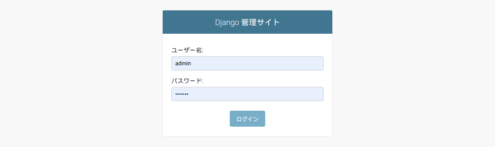
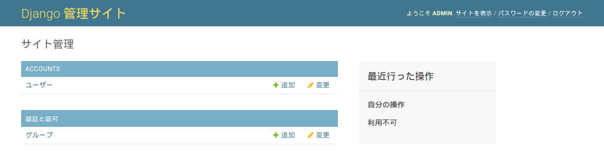
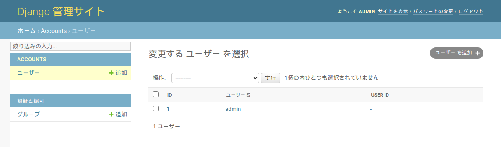





# 管理サイト

以前、[カスタムユーザモデルの作成](09.md)では、認証ユーザ用のユーザモデルとして`accounts`アプリケーションにおいてカスタムユーザモデル`CustomUser`を定義しました。それに加えて、[モデルの定義](13.md)では、`online`アプリケーションにおいてユーザモデル`User`も定義しています。これらを紐付けるために`accounts/models.py`に下記コードを追加してください。

リスト1: `recsys_django/accounts/models.py`
```py
from django.db import models
from django.contrib.auth.models import AbstractUser

from online.models import User  # 追加


class CustomUser(AbstractUser):
    """カスタムユーザモデル

    Attributes
    ----------
    user : OneToOneField
        ユーザ
    """
    user = models.OneToOneField(User, models.DO_NOTHING, null=True)     # 追加
```

下記コマンドを実行し、マイグレーションファイルを作成します。

```bash
(rsl-django) $ export DB_USER=rsl
(rsl-django) $ export DB_PASSWORD=【パスワード】
(rsl-django) $ python manage.py makemigrations accounts
Migrations for 'accounts':
  accounts/migrations/0002_customuser_user.py
    - Add field user to customuser
```

つづいて、マイグレーションを実行します。

```bash
(rsl-django) $ python manage.py migrate
Operations to perform:
  Apply all migrations: accounts, admin, auth, contenttypes, online, sessions
Running migrations:
  Applying accounts.0002_customuser_user... OK
```

PostgreSQL上で`accounts_customuser`テーブルの構成を確認してみましょう。

```pgsql
recsys_django=# \d accounts_customuser
                                Table "public.accounts_customuser"
    Column    |           Type           | Collation | Nullable |             Default              
--------------+--------------------------+-----------+----------+----------------------------------
 id           | bigint                   |           | not null | generated by default as identity
 password     | character varying(128)   |           | not null | 
 last_login   | timestamp with time zone |           |          | 
 is_superuser | boolean                  |           | not null | 
 username     | character varying(150)   |           | not null | 
 first_name   | character varying(150)   |           | not null | 
 last_name    | character varying(150)   |           | not null | 
 email        | character varying(254)   |           | not null | 
 is_staff     | boolean                  |           | not null | 
 is_active    | boolean                  |           | not null | 
 date_joined  | timestamp with time zone |           | not null | 
 user_id      | integer                  |           |          | 
...（略）...
Foreign-key constraints:
    "accounts_customuser_user_id_d3560d05_fk_users_user_id" FOREIGN KEY (user_id) REFERENCES users(user_id) DEFERRABLE INITIALLY DEFERRED
...（略）...
```

上記のように、`users`テーブルの`user_id`を参照する外部キーとして`user_id`カラムが追加されていることがわかります。この`user_id`により、新規に登録されたユーザが`users`テーブル上のユーザと紐付けられることになります。

つづいて、ユーザを管理しやすくするため管理サイトを用意します。`CustomUser`モデルを管理サイトに登録するため、`accounts/admin.py`に下記のコードを記述します。

リスト2: `recsys_django/accounts/admin.py`
```py
from django.contrib import admin

from accounts.models import CustomUser


class CustomUserAdmin(admin.ModelAdmin):
    """カスタムユーザ管理クラス
    """
    list_display =  ('id', 'username', 'user_id')
    list_display_links = ('id', 'username', 'user_id')


admin.site.register(CustomUser, CustomUserAdmin)
```

次に、管理者権限をもつスーパーユーザを作成します。`manage.py`があるディレクトリにいることを確認したうえで、下記コマンドを実行してください。メールアドレス、Passwordは任意のもので結構です。

```bash
(rsl-django) $ python manage.py createsuperuser
ユーザー名: admin
メールアドレス: admin@recsys-django.org
Password: 
Password (again): 
Superuser created successfully.
```

ブラウザからDjango管理サイトにアクセスするため下記のURLにアクセスしてください。末尾に`admin/`を付けていることに注意してください。

`http://localhost:8000/admin/`



Django管理サイトへのログイン画面が表示されました。ここで、先ほど作成したスーパーユーザのユーザー名とパスワードでログインしてください。



管理サイトの画面が表示されます。



[ユーザー]をクリックすると、上図のように先ほど作成したスーパーユーザである`admin`が確認できます。ここでは、一旦、ログアウトしておきましょう。

なお，管理サイトの詳細については文献[1]を参照してください．

#### 参考
1. 現場で使える Django の教科書《基礎編》 # 第13章 管理サイト（Django Admin）


