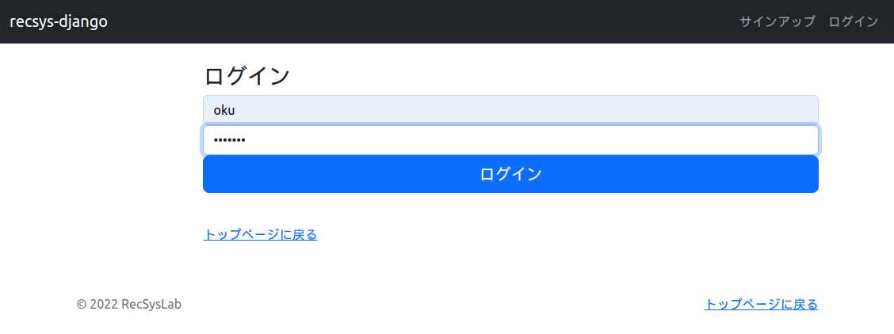
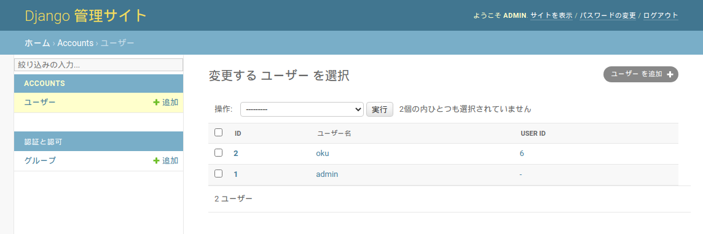





# ログイン機能の実装

新規ユーザのサインアップページおよびログイン／ログアウトページを作成しましょう。まず、`recsys_django/accounts/`ディレクトリに`templates/`ディレクトリを作成してください。作成した`templates/`ディレクトリに`signup.html`、`signup_success.html`、`login.html`、`logout.html`を作成し、それぞれ下記のコードを記述してください。

リスト1: `recsys_django/accounts/templates/signup.html`
```html

Signup | recsys-django


    <div class="row">
        <div class="col offset-2">
            <h3>サインアップ</h3>
            <form action="" method="post">
                
                
                    <div>
                        {{ field.label_tag }}<br/>
                        {{ field }}
                        
                            <small style="color: grey">{{ field.help_text }}</small>
                        
                        
                            <p style="color: red">{{ error }}</p>
                        
                    </div>
                

                
                    <div>
                        <ul>
                            
                                <li style="color: red">{{ non_field_error }}</li>
                            
                        </ul>
                    </div>
                
                <input type="submit" value="サインアップ">
            </form>
            <br/>
            <p>
                <a href="">
                    トップページに戻る
                </a>
            </p>
        </div>
    </div>

```

リスト2: `recsys_django/accounts/templates/signup_success.html`
```html

Registration Complete | recsys-django


    <div class="row">
        <div class="col offset-4 py-4">
            <h3>サインアップが完了しました。</h3>
            <p>
                <a href="">
                    ログインはこちら
                </a>
            </p>
        </div>
    </div>

```

リスト3: `recsys_django/accounts/templates/login.html`
```html

Login | recsys-django


    <div class="row">
        <div class="col offset-2">
            <h3>ログイン</h3>
            
                <p style="color: red">ユーザ名とパスワードが一致しません。</p>
            
            <form method="post">
                
                <label for="Username" class="visually-hidden">User name</label>
                <input type="text"
                       name="username"
                       id="id_username"
                       maxlength="150"
                       autocapitalize="none"
                       autocomplete="username"
                       class="form-control"
                       placeholder="ユーザ名"
                       required autofocus>

                <label for="Password" class="visually-hidden">Password</label>
                <input type="password"
                       name="password"
                       id="id_password"
                       autocomplete="current-password"
                       class="form-control"
                       placeholder="パスワード"
                       required autofocus>

                <input class="w-100 btn btn-lg btn-primary" type="submit" value="ログイン">
                <!-- ログイン直後のリダイレクト先(トップページ)のURLパターンを設定 -->
                <input type="hidden" name="next" value="">
            </form>
            <br/>
            <p>
                <a href="">
                    トップページに戻る
                </a>
            </p>
        </div>
    </div>

```

リスト4: `recsys_django/accounts/templates/logout.html`
```html

Logout | recsys-django


    <div class="row">
        <div class="col offset-2">
            <h3>ログアウトしました。</h3>
            <br/>
            <p>
                <a href="">
                    トップページに戻る
                </a>
            </p>
        </div>
    </div>

```

つづいて、`recsys_django/accounts/views.py`に下記コードを記述します。

リスト5: `recsys_django/accounts/views.py`
```py
from django.views.generic import View, TemplateView
from django.shortcuts import render, redirect
from django.urls import reverse
from django.db.models import Max

from online.models import User
from .forms import SignupForm
from .models import CustomUser


class SignupView(View):
    """サインアップページビュー

    Attributes
    ----------
    context: dict
        コンテキスト
    """

    def __init__(self):
        self.context = {
            'form': SignupForm(),
        }

    def get(self, request, *args, **kwargs):
        """sigunup.htmlをレンダリングしたレスポンスを取得する。

        Parameters
        ----------
        request : WSGIRequest
            リクエスト

        Returns
        -------
        HttpResponse
            signup.htmlをレンダリングしたレスポンスを返す。
        """
        return render(request, 'signup.html', self.context)

    def post(self, request, *args, **kwargs):
        """新規にサインアップしたユーザを登録する。

        Parameters
        ----------
        request : WSGIRequest
            リクエスト

        Returns
        -------
        HttpResponse
            サインアップに成功した場合、accounts:signup_successにリダイレクトする。
            サインアップに失敗した場合、signup.htmlをレンダリングしたレスポンスを返す。
        """
        # フォームのバインディング
        signup_form = SignupForm(request.POST)

        # フォームのバリデーション
        if not signup_form.is_valid():
            # サインアップに失敗した場合
            self.context['form'] = signup_form
            return render(request, 'signup.html', self.context)

        # フォームデータの取得
        username = signup_form.cleaned_data['username']
        nickname = signup_form.cleaned_data['nickname']
        password = signup_form.cleaned_data['password']

        # ユーザの登録
        custom_user = CustomUser.objects.create_user(username=username, password=password)
        user_id = User.objects.all().aggregate(Max('user_id'))['user_id__max'] + 1
        # Userモデルにも登録し、CustomUserモデルのユーザとUserモデルのユーザを紐づけする。
        user = User(user_id=user_id, name=nickname)
        user.save()
        custom_user.user = user
        custom_user.save()

        # テンプレートのリダイレクト
        return redirect(reverse('accounts:signup_success'))


class SignupSuccessView(TemplateView):
    """サインアップ完了ページビュー
    """
    # レンダリングするテンプレート
    template_name = "signup_success.html"
```

さらに、`recsys_django/accounts/`ディレクトリ内に`forms.py`、`urls.py`を作成してください。それぞれ、下記のコードを記述してください。

リスト6: `recsys_django/accounts/forms.py`
```py
from django import forms
from django.contrib.auth.forms import UsernameField

from .models import CustomUser


class SignupForm(forms.Form):
    """サインアップフォーム

    Attributes
    ----------
    username : UsernameField
        ユーザ名
    nickname : CharField
        ニックネーム
    password : CharField
        パスワード
    password2 : CharField
        確認用パスワード
    """
    username = UsernameField(
        label='ユーザ名',
        min_length=3,
        max_length=8,
        help_text='3文字以上8文字以内の半角英数字で入力してください。',
    )

    nickname = forms.CharField(
        label='ニックネーム',
        min_length=1,
        max_length=32,
    )

    password = forms.CharField(
        label='パスワード',
        strip=False,
        min_length=6,
        max_length=255,
        widget=forms.PasswordInput(render_value=True),
        help_text='半角英数字と記号のみ入力可能です。',
    )

    password2 = forms.CharField(
        label='パスワード（確認用）',
        strip=False,
        min_length=6,
        max_length=255,
        widget=forms.PasswordInput(render_value=True),
        help_text='確認のため、もう一度同じパスワードを入力してください。',
    )

    def clean_username(self):
        username = self.cleaned_data['username']
        if not username.encode('utf-8').isalnum():
            self.add_error(None, 'ユーザ名は半角英数字のみで入力してください。')
        return username

    def clean(self):
        super(SignupForm, self).clean()

        username = self.cleaned_data['username']
        if CustomUser.objects.filter(username=username).exists():
            self.add_error(None, 'このユーザ名は既に使用されています。')

        password = self.cleaned_data['password']
        password2 = self.data.get('password2')
        if password != password2:
            self.add_error(None, 'パスワードとパスワード（確認用）が一致しません。')
```

リスト7: `recsys_django/accounts/urls.py`
```py
from django.urls import path
from django.contrib.auth import views as auth_views

from . import views


app_name = 'accounts'
urlpatterns = [
    path('signup/', views.SignupView.as_view(), name='signup'),
    path('signup_success/', views.SignupSuccessView.as_view(), name='signup_success'),
    path('login/', auth_views.LoginView.as_view(template_name='login.html'), name='login'),
    path('logout/', auth_views.LogoutView.as_view(template_name='logout.html'), name='logout'),
]
```

`recsys_django/recsys_django/urls.py`に下記コードを追加します。

リスト8: `recsys_django/recsys_django/urls.py`
```py
...（略）...
urlpatterns = [
    path('admin/', admin.site.urls),
    path('', include('online.urls')),
    path('', include('accounts.urls')), # 追加
]
...（略）...
```

`recsys_django/static/css/`ディレクトリに`signup.css`を作成し、下記コードを記述してください。

リスト9: `recsys_django/static/css/signup.css`
```py
.form-signin {
  width: 100%;
  max-width: 330px;
  padding: 15px;
  margin: auto;
}

.form-signin .checkbox {
  font-weight: 400;
}

.form-signin .form-floating:focus-within {
  z-index: 2;
}

.form-signin input[type="email"] {
  margin-bottom: -1px;
  border-bottom-right-radius: 0;
  border-bottom-left-radius: 0;
}

.form-signin input[type="password"] {
  margin-bottom: 10px;
  border-top-left-radius: 0;
  border-top-right-radius: 0;
}
```

`base.html`を下記のように修正します。

リスト10: `recsys_django/online/templates/base.html`
```html
...（略）...
                    <ul class="navbar-nav mr-auto mb-2 mb-md-0">
                        
                            <!-- ログイン中のメニュー -->
                            <div class="dropdown">
                                <button type="button" class="btn btn-secondary dropdown-toggle" data-bs-toggle="dropdown" aria-expanded="false">
                                    {{ user.username }}
                                </button>
                                <ul class="dropdown-menu">
                                    <li><a class="dropdown-item" href="">ログアウト</a></li>  <!-- 修正 -->
                                </ul>
                            </div>
                        
                            <!-- ログイン状態ではない場合のメニュー -->
                            <li class="nav-item">
                                <a class="nav-link" href="">サインアップ</a>                  <!-- 修正 -->
                            </li>
                            <li class="nav-item">
                                <a class="nav-link" href="">ログイン</a>                       <!-- 修正 -->
                            </li>
                        
                    </ul>
...（略）...
```

ブラウザで下記のURLにアクセスしてみましょう。

`http://localhost:8000/`

まず、右上メニューの**サインアップ**をクリックしてください。


サインアップ画面が表示されました。任意のユーザ名、ニックネーム、パスワードを入力し、**サインアップ**ボタンをクリックしてください。


「サインアップが完了しました。」と表示されます。つづいて、**ログインはこちら**または右上メニューの**ログイン**をクリックしてください。



ログイン画面が表示されますので、先ほど登録したユーザアカウントでログインしてみましょう。


上図のように右上メニューにログインユーザ名が表示されればログイン成功です。


右上メニューのユーザアカウントから**ログアウト**を選択すると、ログアウトできます。


「ログアウトしました。」と表示されればログアウト完了です。右上メニューがログイン前の表示に戻りました。

さて、実際に登録されたユーザをPostgreSQL上で確認してみましょう。PostgreSQL上で下記のSQLを実行してください。

```pgsql
recsys_django=# SELECT * FROM accounts_customuser;
 id |                                         password                                         |          last_login           | is_superuser | username | first_name | last_name |          email          | is_staff | is_active |          date_joined          | user_id 
----+------------------------------------------------------------------------------------------+-------------------------------+--------------+----------+------------+-----------+-------------------------+----------+-----------+-------------------------------+---------
  1 | pbkdf2_sha256$320000$75fW3zy9Ry56iMzGXVFmbQ$2Lr/QLM3JAbyNk79QJ9H0UHEnyaIEkNan1TDHzkVo24= | 2022-09-03 14:57:27.797376+09 | t            | admin    |            |           | admin@recsys-django.org | t        | t         | 2022-09-03 14:56:07.536841+09 |        
  2 | pbkdf2_sha256$320000$1rQgwTZAX9VJAXESrHHtNX$/hfLaq9q9kijVulpXHPEdeDIFryVp6EURY1xCkXUftM= | 2022-09-03 15:51:31.892094+09 | f            | oku      |            |           |                         | f        | t         | 2022-09-03 15:50:30.261316+09 |       6
(2 rows)
```

先ほど作成したユーザが登録されていることが確認できます。ここで、`user_id`カラムに`6`が設定されていますが、これは`users`テーブル上の`user_id`に対応します。下記のSQLを実行してください。

```pgsql
recsys_django=# SELECT * FROM users;
 user_id |  name  | age | sex 
---------+--------+-----+-----
       1 | Alice  |  20 | f
       2 | Bruno  |  22 | m
       3 | Chiara |  21 | f
       4 | Dhruv  |  21 | m
       5 | Emi    |  20 | f
       6 | Kenta  |     | 
(6 rows)
```

この`user_id = 6`のユーザが紐づけられているということが確認できます。

また、管理サイトでも確認してみましょう。ブラウザで下記のURLにアクセスしてください。

`http://localhost:8000/admin/`

スーパーユーザでログインした後、**ユーザー**をクリックしてください。



先ほど作成したユーザが登録されていることが確認できます。

サインアップやログイン機能の実装の詳細については、文献[1]を参照してください。

#### 参考
1. Django4 Webアプリ開発 実装ハンドブック # 7.2 認証用のaccountsアプリを作ろう


