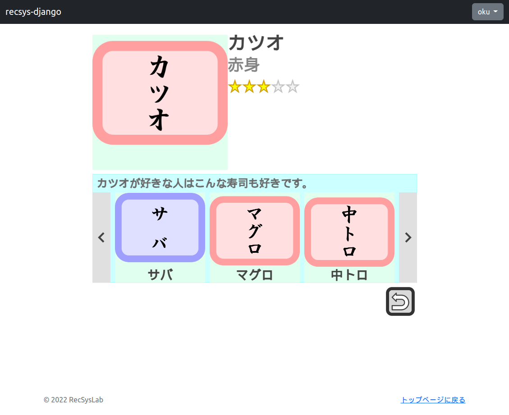





# データベースへのデータの登録

アイテムの詳細ページから対象アイテムに対する評価値を登録できるようにしましょう。まず、評価値ビューを定義します。`online/views.py`に下記のコードを追加してください。

リスト1: `recsys_django/onlien/views.py`
```py
import json

from django.views.generic import View
from django.shortcuts import render
from django.http import HttpResponse

# Ratingを追加
from .models import Item, Rating, ReclistPopularity, ReclistSimilarity, ReclistItemcf
from .mappers import RecRandomMapper, RecPopularityMapper, RecSimilarityMapper, RecItemcfMapper
...（略）...
class RatingView(View):
    """評価値ビュー
    """

    def get(self, request, item_id, *args, **kwargs):
        """対象ユーザの対象アイテムの評価値を取得する。

        Parameters
        ----------
        request : WSGIRequest
            リクエスト
        item_id : int
            対象アイテムのアイテムID

        Returns
        -------
        HttpResponse
            推薦説明と推薦リストをJSON形式で返す。
            対象ユーザがログイン状態でなければ{'rating': -1}を返す。
            対象ユーザが対象アイテムに対して未評価の場合、{'rating': 0}を返す。
        """
        if not request.user.is_authenticated:
            # 対象ユーザがログイン状態でない場合
            response = {
                'rating': -1,
            }
            response_json = json.dumps(response)
            return HttpResponse(response_json, content_type='application/json')

        # オブジェクトの取得
        user = request.user.user
        item = Item.objects.get(pk=item_id)
        rating_model = Rating.objects.filter(user=user, item=item).first()
        rating = rating_model.rating if rating_model is not None else 0

        # レスポンスの生成
        response = {
            'rating': rating,
        }
        response_json = json.dumps(response)

        # レスポンスの返却
        return HttpResponse(response_json, content_type='application/json')

    def post(self, request, item_id, *args, **kwargs):
        """対象ユーザの対象アイテムに対する評価値を登録する。

        Parameters
        ----------
        request : WSGIRequest
            リクエスト
        item_id : int
            対象アイテムのアイテムID

        Returns
        -------
        HttpResponse
            推薦説明と推薦リストをJSON形式で返す。
            対象ユーザがログイン状態でなければ{'rating': -1}を返す。
            対象ユーザが対象アイテムに対して未評価の場合、{'rating': 0}を返す。
        """
        if not request.user.is_authenticated:
            # 対象ユーザがログイン状態でない場合
            response = {
                'user_id': None,
            }
            response_json = json.dumps(response)
            return HttpResponse(response_json, content_type='application/json')

        # リクエストの取得
        rating = request.POST.get('rating')

        # オブジェクトの取得
        user = request.user.user
        item = Item.objects.get(pk=item_id)

        # モデルの更新
        rating_model = Rating.objects.filter(user=user, item=item).first()
        # データの追加，更新
        if rating_model is not None:
            rating_model.rating = rating
            rating_model.save()
        else:
            rating_model = Rating(user=user, item=item, rating=rating)
            rating_model.save()

        # レスポンスの生成
        response = {
        }
        response_json = json.dumps(response)

        # レスポンスの返却
        return HttpResponse(response_json, content_type='application/json')
```

ここで、`RatingView`クラスには`get()`メソッドと`post()`メソッドを実装しています。`get()`メソッドはデータベースから評価値を取得するときに、`post()`メソッドはデータベース上の評価値を更新するときに呼び出されます。対象ユーザがログイン状態であるか否かは、`request.user.is_auhenticated`で確認できます。`get()`メソッドも`post()`メソッドも、それぞれ冒頭で対象ユーザがログイン状態であるか判定し、ログイン状態でない場合は何もしないようにしています。

これらのメソッドは、`DetailPage.js`で既に実装済みの下記のコードから呼ばれるようになっています。

リスト2: `recsys_django/static/js/DetailPage.js`
```js
    /*
     * アクティブユーザの対象アイテムに対する評価値を取得する。
     */
    getRating() {
        let thisPage = this;
        $.ajax({
            url: this.itemDetailComponent.item.id.toString() + '/rating/',
            method: 'GET',
            data: {
            },
            timeout: 10000,
            dataType: "json",
        }).done(function(response) {
            let rating = response.rating;
            thisPage.itemDetailComponent.starRating.setRating(rating);
            thisPage.draw();
        }).fail(function(response) {
            window.alert('DetailPage::getRating() : failed');
        });
    }
    /*
     * アクティブユーザの対象アイテムへの評価値を更新する。
     * @param rating    評価値
     */
    postRating(rating) {
        let thisPage = this;
        $.ajax({
            url: this.itemDetailComponent.item.id.toString() + '/rating/',
            method: 'POST',
            data: {
                'rating': rating,
            },
            timeout: 10000,
            dataType: "json",
        }).done(function(response) {
            thisPage.itemDetailComponent.starRating.setRating(rating);
            thisPage.draw();
        }).fail(function(response) {
            window.alert('DetailPage::postRating() : failed');
        });
    }
```

このように`url`には、対象アイテムのIDと`'/rating/'`をつなげた文字列を与えています。また、`method`には、それぞれ`GET`と`POST`を設定しています。それぞれに対応して、`RatingView`クラスの`get()`メソッド、`post()`メソッドが呼ばれることになります。

つづいて、`recsys_django/onlien/urls.py`に下記コードを追加してください。

リスト3: `recsys_django/onlien/urls.py`
```py
from django.urls import path
from . import views

app_name = 'online'
urlpatterns = [
    path('', views.IndexView.as_view(), name='index'),
    path('random/', views.RandomView.as_view(), name='random'),
    path('popularity/', views.PopularityView.as_view(), name='popularity'),
    path('<int:item_id>/similarity/', views.SimilarityView.as_view(), name='similarity'),
    path('itemcf/', views.ItemcfView.as_view(), name='itemcf'),
    path('<int:item_id>/rating/', views.RatingView.as_view(), name='rating'),               # 追加
]
```

さて、POSTリクエストを用いる際にはCSRF対策が必要になります。CSRF対策については、文献[1][2]を参照してください。CSRF対策として、`recsys_django/static/js/`ディレクトリに`csrftoken.js`を作成し、下記のコードを記述してください。

リスト4: `recsys_django/static/js/csrftoken.js`
```py
/**
 * CSRFトークンの取得
 * {@link https://docs.djangoproject.com/ja/2.1/ref/csrf/#ajax}
 */
// using jQuery
function getCookie(name) {
    let cookieValue = null;
    if (document.cookie && document.cookie !== '') {
        let cookies = document.cookie.split(';');
        for (let i = 0; i < cookies.length; i++) {
            let cookie = jQuery.trim(cookies[i]);
            // Does this cookie string begin with the name we want?
            if (cookie.substring(0, name.length + 1) === (name + '=')) {
                cookieValue = decodeURIComponent(cookie.substring(name.length + 1));
                break;
            }
        }
    }
    return cookieValue;
}
let csrftoken = getCookie('csrftoken');

function csrfSafeMethod(method) {
    // these HTTP methods do not require CSRF protection
    return (/^(GET|HEAD|OPTIONS|TRACE)$/.test(method));
}
$.ajaxSetup({
    beforeSend: function(xhr, settings) {
        if (!csrfSafeMethod(settings.type) && !this.crossDomain) {
            xhr.setRequestHeader("X-CSRFToken", csrftoken);
        }
    }
});
```

この`csrftoken.js`を`index.html`から参照します。`index.html`に下記コードを追加してください。

リスト5: `recsys_django/online/templates/index.html`
```js
    ...（略）...
    {# --- js --- #}
    ...（略）...
    <script type="text/javascript" src=""></script>   <!-- 追加 -->
    <script type="text/javascript" src=""></script>
    ...（略）...
```

ブラウザで下記のURLにアクセスしてみましょう。

`http://localhost:8000/`

[ログイン機能の実装](27.md)で作成したアカウントでログインした状態で、アイテム詳細ページから評価値を表す星評価をクリックしてみてください。例えば、「カツオ」に対して評価値`3`を設定してみましょう。



すると、評価値が確定しました。一旦、メインページに戻って、再度「カツオ」の詳細ページを開くと、評価値が`3`で保存されていることがわかります。他にもいくつかのアイテムに対しても評価値を登録したり、更新したりしてみましょう。例えば、「中トロ」の評価値を`5`、「サバ」の評価値を`4`として登録してみます。

正しくデータベースに反映されているか確認してみましょう。PostgreSQL上で下記SQLを実行してください。

```pgsql
recsys_django=# SELCT * FROM ratings;
 id | user_id | item_id | rating 
----+---------+---------+--------
...（略）...
 29 |       6 |       1 |      3
 30 |       6 |       3 |      5
 31 |       6 |       7 |      4
(31 rows)
```

上記のとおり、先ほど登録した評価値が順にテーブルの末尾に登録されていることが確認できます。

#### 参考
1. [クロスサイトリクエストフォージェリ (CSRF) 対策 \| Django ドキュメント \| Django](https://docs.djangoproject.com/ja/4.1/ref/csrf/#module-django.middleware.csrf)
1. 現場で使える Django の教科書《実践編》 # 4.2.2 POSTリクエスト


