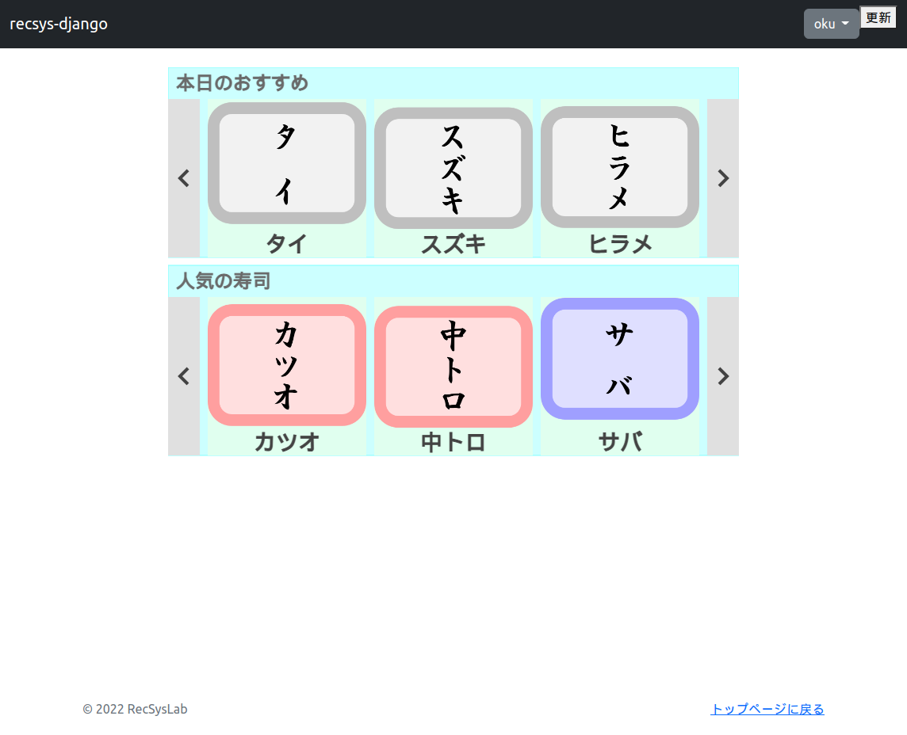
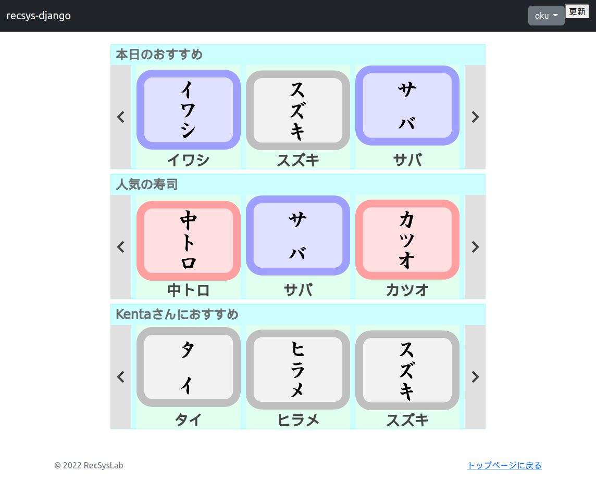





# オフライン処理の実装

[さまざまな推薦システムによる推薦リストの取得](24.md)で実装したように、メインページ上には、ランダム推薦システムによる推薦リスト、人気ベース推薦システムによる推薦リストに加え、アイテムベース協調フィルタリングによる推薦リスト用の推薦スロットも用意しています。しかし、対象ユーザがログインし、いくつかのアイテムに対して評価値を登録したにもかかわらず、アイテムベース協調フィルタリングによる推薦リストは依然として表示されていません。これは、データベース上の推薦リストが更新されていないためです。多くの場合、推薦リストはリアルタイムに更新されるわけではなく、一定のタイミングでまとめて更新されることになります。これをオフライン処理とよびます。ここでは、オフライン処理による推薦リストの更新処理を実装してみましょう。

オフライン処理は`offline`というアプリケーションで実装することにします。まずは、`offline`アプリケーションを作成しましょう。`manage.py`があるディレクトリにいることを確認したうえで、以下のコマンドを実行してください。

```bash
(rsl-django) $ python manage.py startapp offline
```

すると、現在のディレクトリに、`offline/`というディレクトリが作成されます。この`offline`アプリケーションをプロジェクトに登録しましょう。`settings.py`の`INSTALLED_APPS`に、`offline`アプリケーションを追加します。

リスト1: `recsys_django/recsys_django/settings.py`
```py
...（略）...
INSTALLED_APPS = [
    'django.contrib.admin',
    'django.contrib.auth',
    'django.contrib.contenttypes',
    'django.contrib.sessions',
    'django.contrib.messages',
    'django.contrib.staticfiles',

    'django_bootstrap5',

    'online.apps.OnlineConfig',
    'accounts.apps.AccountsConfig',
    'offline.apps.OfflineConfig',   # 追加
]
...（略）...
```

つづいて、`offline/`ディレクトリに`data/`ディレクトリおよび`recommenders/`ディレクトリを作成してください。さらに、`recommenders/`ディレクトリに下記のソースファイルを作成してください。

- `base_recommender.py`
- `dataset.py`
- `item_similarity.py`
- `itemcf.py`
- `popularity.py`

`tree`コマンドで`offline/`ィレクトリ以下のディレクトリ構成を確認すると下記のとおりとなります。

```bash
(rsl-django) $ tree offline/
offline/
├── __init__.py
├── admin.py
├── apps.py
├── data
├── migrations
│   └── __init__.py
├── models.py
├── recommenders
│   ├── base_recommender.py
│   ├── dataset.py
│   ├── item_similarity.py
│   ├── itemcf.py
│   └── popularity.py
├── tests.py
└── views.py

3 directories, 12 files
```

各ソースファイルには、それぞれ下記のコードを記述してください。なお、クラス設計や推薦アルゴリズムの詳細については、文献[1][2]を参考にしてください。

リスト2: `recsys_django/offline/recommenders/base_recommender.py`
```py
from abc import ABC, abstractmethod

from .dataset import Dataset


class BaseRecommender(ABC):
    """推薦システムの抽象規定クラス
    """

    @abstractmethod
    def recommend(self, dataset: Dataset, top_n: int, **kwargs):
        """推薦リストを作成し、推薦リストテーブルを更新する。

        Parameters
        ----------
        dataset : Dataset
            データセット
        top_n : int
            上位top_n件

        Other Parameters
        ----------------
        推薦システム固有のパラメタ
        """
        pass
```

リスト3: `recsys_django/offline/recommenders/dataset.py`
```py
import numpy as np
import pandas as pd


class Dataset:
    """データセットクラス

    Attributes
    ----------
    users_df : DataFrame
        ユーザデータフレーム
    items_df : DataFrame
        アイテムデータフレーム
    ratings_df : DataFrame
        評価値データフレーム
    rating_matrix_df : DataFrame
        評価値行列データフレーム
    item_similarity_matrix_df : DataFrame
        アイテム-アイテム類似度行列データフレーム
    user_ids : ndarray
        ユーザID配列
    item_ids : ndarray
        アイテムID配列
    """

    def __init__(self, users_csv: str, items_csv: str, ratings_csv: str):
        """コンストラクタ

        Parameters
        ----------
        users_csv : str
            ユーザデータのCSVファイル名
        items_csv : str
            アイテムデータのCSVファイル名
        ratings_csv : str
            評価値データのCSVファイル名
        """
        # データセットを読み込む。
        self.users_df = pd.read_csv(users_csv, index_col=None, header=0, sep='\t')
        self.items_df = pd.read_csv(items_csv, index_col=None, header=0, sep='\t')
        self.ratings_df = pd.read_csv(ratings_csv, index_col=None, header=0, sep='\t')
        self.rating_matrix_df = None
        self.item_similarity_matrix_df = None

        # ユーザID配列、アイテムID配列を取得する。
        self.user_ids = np.array(self.users_df['user_id'].drop_duplicates())
        self.item_ids = np.array(self.items_df['item_id'].drop_duplicates())

    def to_rating_matrix(self, rating_matrix_csv: str):
        """データセットを基に評価値行列を作成する。

        Parameters
        ----------
        rating_matrix_csv : str
            評価値行列の出力先CSVファイル名
        """
        # 評価値行列を作成する。
        self.rating_matrix_df = pd.DataFrame(index=self.user_ids, columns=self.item_ids)

        # 評価値行列の要素を入力する。
        for tpl in self.ratings_df.itertuples():
            user_id = tpl.user_id
            item_id = tpl.item_id
            rating = tpl.rating
            self.rating_matrix_df.loc[user_id, item_id] = rating

        # 評価値行列をcsvで出力する。
        self.rating_matrix_df.to_csv(rating_matrix_csv, index=True, header=True, sep='\t')
        self.rating_matrix_df = pd.read_csv(rating_matrix_csv, index_col=0, header=0, sep='\t')

    def to_item_similarity_matrix(self, item_similarity_matrix_csv: str):
        """データセットを基にアイテム-アイテム類似度行列を作成する。

        Parameters
        ----------
        item_similarity_matrix_csv : str
            アイテム-アイテム類似度行列の出力先CSVファイル名
        """
        def adjusted_cos(i: int, j: int) -> float:
            """評価値行列R2におけるアイテムiとアイテムjの調整コサイン類似度を返す。

            Parameters
            ----------
            i : int
                アイテムiのID
            j : int
                アイテムjのID

            Returns
            -------
            cosine : float
                調整コサイン類似度
            """
            Uij = np.intersect1d(Ui[i], Ui[j])
            if Uij.size <= 0: return 0.0

            num = np.sum([R2[u, i] * R2[u, j] for u in Uij])
            den_i = np.sqrt(np.sum([R2[u, i] ** 2 for u in Uij]))
            den_j = np.sqrt(np.sum([R2[u, j] ** 2 for u in Uij]))
            cosine = num / (den_i * den_j)
            return cosine

        def sim(i: int, j: int) -> float:
            """アイテム類似度関数：アイテムiとアイテムjのアイテム類似度を返す。

            Parameters
            ----------
            i : int
                アイテムiのID
            j : int
                アイテムjのID

            Returns
            -------
            float
                アイテム類似度
            """
            return adjusted_cos(i, j)

        _, _, I, Ui, _, R2, _ = self.load()
        S = np.array([[sim(i, j) for j in I] for i in I])
        self.item_similarity_matrix_df = pd.DataFrame(S, index=self.item_ids, columns=self.item_ids)
        self.item_similarity_matrix_df.to_csv(item_similarity_matrix_csv, index=True, header=True, sep='\t')
        self.item_similarity_matrix_df = pd.read_csv(item_similarity_matrix_csv, index_col=0, header=0, sep='\t')

    def load(self) -> tuple:
        """各データを変数として返す。

        Returns
        -------
        ndarray
            評価値行列
        ndarray
            ユーザ配列
        ndarray
            アイテム配列
        list[ndarray]
            アイテムiを評価済みのユーザ配列のリスト
        list[ndarray]
            ユーザuが評価済みのアイテム配列のリスト
        ndarray
            平均中心化評価値行列
        ndarray
            アイテム-アイテム類似度行列
        """
        R = np.array(self.rating_matrix_df)
        U = np.arange(R.shape[0])
        I = np.arange(R.shape[1])
        Ui = [U[~np.isnan(R)[:, i]] for i in I]
        Iu = [I[~np.isnan(R)[u, :]] for u in U]
        ru_mean = np.nanmean(R, axis=1)
        # ri_mean = np.nanmean(R, axis=0)
        R2 = R - ru_mean.reshape((ru_mean.size, 1))
        S = np.array(self.item_similarity_matrix_df)
        return R, U, I, Ui, Iu, R2, S
```

リスト4: `recsys_django/offline/recommenders/item_similarity.py`
```py
import pandas as pd

from django.db import connection

from online.models import Item, ReclistSimilarity
from .base_recommender import BaseRecommender
from .dataset import Dataset


class ItemSimilarityRecommender(BaseRecommender):
    """アイテム類似度ベース推薦システム
    """

    def recommend(self, dataset: Dataset, top_n: int, **kwargs):
        """アイテム類似度ベース推薦システムによる推薦リストを作成し、推薦リストテーブルを更新する。

        Parameters
        ----------
        dataset : Dataset
            データセット
        top_n : int
            上位top_n件

        Other Parameters
        ----------------
        minimum_similarity : float, optional
            類似度のしきい値
        """
        # 類似度のしきい値
        minimum_similarity = kwargs.get('minimum_similarity', 0.0)

        # データの取得
        _, _, _, _, _, _, S = dataset.load()
        S_df = pd.DataFrame(S, index=dataset.item_ids, columns=dataset.item_ids)

        # 推薦リストの作成
        # ベースアイテムとのアイテム類似度をスコアとする。
        reclist_df = S_df.stack()
        reclist_df = reclist_df.reset_index()
        reclist_df = reclist_df.rename(columns={
            'level_0': 'base_item_id',
            'level_1': 'item_id',
            0: 'score',
        })

        # ベースアイテムと同一のアイテムおよびアイテム類似度がしきい値未満のアイテムとを除外する。
        reclist_df = reclist_df.query('base_item_id != item_id & score >= @minimum_similarity').copy()

        # ベースアイテムごとにスコアの降順に順位を付けて、ソートする。
        # reclist_df.loc[:, 'rank'] = reclist_df.groupby(['base_item_id'])['score'].rank(ascending=False, method='first')
        reclist_df['rank'] = reclist_df.groupby(['base_item_id'])['score'].rank(ascending=False, method='first')
        reclist_df = reclist_df.sort_values(['base_item_id', 'rank'])
        # ベースアイテムごとに上位top_n件を残す。
        reclist_df = reclist_df.groupby('base_item_id')
        reclist_df = reclist_df.head(top_n)

        # 推薦リストテーブルの更新
        cursor = connection.cursor()
        cursor.execute("TRUNCATE TABLE reclist_similarity RESTART IDENTITY")
        for tuple_ in reclist_df.itertuples():
            base_item = Item.objects.get(pk=tuple_.base_item_id)
            rank = tuple_.rank
            item = Item.objects.get(pk=tuple_.item_id)
            score = tuple_.score
            rec = ReclistSimilarity(base_item=base_item, rank=rank, item=item, score=score)
            rec.save()
```

リスト5: `recsys_django/offline/recommenders/itemcf.py`
```py
import pandas as pd
import numpy as np

from django.db import connection

from online.models import User, Item, ReclistItemcf
from .base_recommender import BaseRecommender
from .dataset import Dataset


class ItemCFRecommender(BaseRecommender):
    """アイテムベース協調フィルタリング
    """

    def recommend(self, dataset: Dataset, top_n: int, **kwargs):
        """アイテムベース協調フィルタリングによる推薦リストを作成し、推薦リストテーブルを更新する。

        Parameters
        ----------
        dataset : Dataset
            データセット
        top_n : int
            上位top_n件

        Other Parameters
        ----------------
        k_items : int, optional
            近傍アイテム数
        minimum_similarity : float, optional
            類似度のしきい値
        """
        # 近傍アイテム数
        k_items = kwargs.get('k_items', 3)
        # 類似度のしきい値
        minimum_similarity = kwargs.get('minimum_similarity', 0.0)

        def predict(u: int, i: int) -> float:
            """予測関数：ユーザuのアイテムiに対する予測評価値を返す。

            Parameters
            ----------
            u : int
                ユーザuのID
            i : int
                アイテムiのID

            Returns
            -------
            float
                ユーザuのアイテムiに対する予測評価値
            """
            # アイテムiの類似アイテム集合の中でユーザuが評価値を与えているアイテム集合
            Iiu = np.intersect1d(Ii[i], Iu[u])

            # ユーザuのアイテムiに対する予測評価値
            ru_mean = np.nanmean(R, axis=1)
            if Iiu.size <= 0: return ru_mean[u]

            num = np.sum([(S[i, j] * R[u, j]) for j in Iiu])
            den = np.sum([np.abs(S[i, j]) for j in Iiu])
            rui_pred = num / den if den > 0 else 0.0

            return rui_pred

        # データの取得
        R, U, I, _, Iu, _, S = dataset.load()

        # アイテム-アイテム類似度行列から対象アイテムを除外した辞書を作成する。
        Ii = {i: {j: S[i, j] for j in I if i != j} for i in I}
        Ii = {i: dict(sorted(Ii[i].items(), key=lambda x: x[1], reverse=True)[:k_items]) for i in I}
        Ii = {i: {j: s for j, s in Ii[i].items() if s >= minimum_similarity} for i in I}
        Ii = {i: np.array(list(Ii[i].keys())) for i in I}

        # 評価値行列の欠損値を予測評価値で補完する。
        R3 = np.array([[predict(u, i) if np.isnan(R[u, i]) else np.nan for i in I] for u in U])
        R3_df = pd.DataFrame(R3, index=dataset.user_ids, columns=dataset.item_ids)

        # 推薦リストの作成
        reclist_df = R3_df.stack()
        reclist_df = reclist_df.reset_index()
        reclist_df = reclist_df.rename(columns={
            'level_0': 'user_id',
            'level_1': 'item_id',
            0: 'score',
        })

        # アイテム類似度がしきい値未満のアイテムとを除外する。
        reclist_df = reclist_df.query('score >= @minimum_similarity')

        # 対象ユーザごとにスコアの降順に順位を付けて、ソートする。
        reclist_df.loc[:, 'rank'] = reclist_df.groupby(['user_id'])['score'].rank(ascending=False, method='first')
        reclist_df = reclist_df.sort_values(['user_id', 'rank'])
        # 対象ユーザごとに上位top_n件を残す。
        reclist_df = reclist_df.groupby('user_id')
        reclist_df = reclist_df.head(top_n)

        # 推薦リストテーブルの更新
        cursor = connection.cursor()
        cursor.execute("TRUNCATE TABLE reclist_itemcf RESTART IDENTITY")
        for tuple_ in reclist_df.itertuples():
            user = User.objects.get(pk=tuple_.user_id)
            rank = tuple_.rank
            item = Item.objects.get(pk=tuple_.item_id)
            score = tuple_.score
            rec = ReclistItemcf(user=user, rank=rank, item=item, score=score)
            rec.save()
```

リスト6: `recsys_django/offline/recommenders/popularity.py`
```py
import pandas as pd
import numpy as np

from django.db import connection

from online.models import Item, ReclistPopularity
from .base_recommender import BaseRecommender
from .dataset import Dataset


class PopularityRecommender(BaseRecommender):
    """人気ベース推薦システム
    """

    def recommend(self, dataset: Dataset, top_n: int, **kwargs):
        """人気ベース推薦システムによる推薦リストを作成し、推薦リストテーブルを更新する。

        Parameters
        ----------
        dataset : Dataset
            データセット
        top_n : int
            上位top_n件

        Other Parameters
        ----------------
        minimum_num_rating : int, optional
            評価数のしきい値
        """
        # 評価数のしきい値
        minimum_num_rating = kwargs.get('minimum_num_rating', 0)

        # データの取得
        R, _, I, _, _, _, _ = dataset.load()

        # 評価数のしきい値以上のアイテムを取得する。
        I2 = I[np.count_nonzero(~np.isnan(R), axis=0) >= minimum_num_rating]
        # 各アイテムに対する平均評価値を取得する。
        ri_mean = np.nanmean(R, axis=0)

        # 推薦リストの作成
        # 各アイテムに対する平均評価値をスコアとする。
        reclist_df = pd.DataFrame({
            'item_id': dataset.item_ids[I2],
            'score': ri_mean[I2],
        })

        # スコアの降順に順位を付けてソートし、上位top_n件を残す。
        reclist_df.loc[:, 'rank'] = reclist_df['score'].rank(ascending=False, method='first')
        reclist_df = reclist_df.sort_values(['rank'])
        reclist_df = reclist_df.head(top_n)

        # 推薦リストテーブルの更新
        cursor = connection.cursor()
        cursor.execute("TRUNCATE TABLE reclist_popularity RESTART IDENTITY")
        for tuple_ in reclist_df.itertuples():
            rank = tuple_.rank
            item = Item.objects.get(pk=tuple_.item_id)
            score = tuple_.score
            rec = ReclistPopularity(rank=rank, item=item, score=score)
            rec.save()
```

つづいて、更新ビューを作成します。`offline/views.py`に下記のコードを追加してください。

リスト7: `recsys_django/offline/views.py`
```py
import pandas as pd

from django.views.generic import View
from django.shortcuts import redirect
from django.urls import reverse
from django.http import HttpResponse

from online.models import User, Item, Rating
from .recommenders.dataset import Dataset
from .recommenders.popularity import PopularityRecommender
from .recommenders.item_similarity import ItemSimilarityRecommender
from .recommenders.itemcf import ItemCFRecommender


class UpdateView(View):
    """更新ビュー
    """

    def post(self, request, *args, **kwargs):
        """推薦リストを更新する。

        Returns
        -------
        HttpResponse
            recommender:indexにリダイレクトする。
        """
        users_df = pd.DataFrame(list(User.objects.all().values()))
        items_df = pd.DataFrame(list(Item.objects.all().values()))
        ratings_df = pd.DataFrame(list(Rating.objects.all().values()))
        users_df.to_csv('offline/data/users.csv', index=True, header=True, sep='\t')
        items_df.to_csv('offline/data/items.csv', index=True, header=True, sep='\t')
        ratings_df.to_csv('offline/data/ratings.csv', index=True, header=True, sep='\t')

        # データセットのCSVファイルから各データセットを準備する。
        dataset = Dataset('offline/data/users.csv', 'offline/data/items.csv', 'offline/data/ratings.csv')
        dataset.to_rating_matrix('offline/data/rating_matrix.csv')
        dataset.to_item_similarity_matrix('offline/data/item_similarity_matrix.csv')

        # 各推薦システムを実行し、推薦リストをCSVファイルに出力する。
        recommender = PopularityRecommender()
        recommender.recommend(dataset, top_n=3, minimum_num_rating=3)
        recommender = ItemSimilarityRecommender()
        recommender.recommend(dataset, top_n=3, minimum_similarity=0.0)
        recommender = ItemCFRecommender()
        recommender.recommend(dataset, top_n=3, minimum_similarity=0.0)

        return redirect(reverse('online:index'))
```

これでオフライン処理の実装はできました。それでは、インタフェース上に「更新」ボタンを設置し、その「更新」ボタンをクリックすることで、このオフライン処理が実行されるようにしましょう。

まずは、ナビゲーションバー上に「更新」ボタンを設置します。`base.html`に下記のコードを追加してください。

リスト8: `recsts_django/online/recommender/templates/base.html`
```html
...（略）...
        <!-- ナビゲーションバー -->
        <nav class="navbar navbar-expand-md navbar-dark bg-dark mb-4">
            <div class="container-fluid">
                <div class="collapse navbar-collapse" id="navbarCollapse">
                    <ul class="navbar-nav me-auto mb-2 mb-md-0">
                        <li class="nav-item">
                            <a class="navbar-brand" href="">recsys-django</a>
                        </li>
                    </ul>
                    <ul class="navbar-nav mr-auto mb-2 mb-md-0">
                        
                            <!-- ログイン中のメニュー -->
                            <div class="dropdown">
                                <button type="button" class="btn btn-secondary dropdown-toggle" data-bs-toggle="dropdown" aria-expanded="false">
                                    {{ user.username }}
                                </button>
                                <ul class="dropdown-menu">
                                    <li><a class="dropdown-item" href="">ログアウト</a></li>
                                </ul>
                            </div>
                        
                            <!-- ログイン状態ではない場合のメニュー -->
                            <li class="nav-item">
                                <a class="nav-link" href="">サインアップ</a>
                            </li>
                            <li class="nav-item">
                                <a class="nav-link" href="">ログイン</a>
                            </li>
                        
                    </ul>
                    <!-- 以下を追加 -->
                    <form method="post">
                        
                        <button type="submit" formaction="">更新</button>
                    </form>
                    <!-- ここまで -->
                </div>
            </div>
        </nav>
...（略）...
```

更新ビューを呼ぶために`URLconf`を設定します。`recsys_django/offline/`に`urls.py`を作成し、下記のコードを記述してください。

リスト9: `recsys_django/offline/urls.py`
```py
from django.urls import path
from . import views

app_name = 'offline'
urlpatterns = [
    path('update/', views.UpdateView.as_view(), name='update'),
]
```

さらに、`recsys_django/recsys_django/urls.py`に下記コードを追加してください。

リスト10: `recsys_django/recsys_django/urls.py`
...（略）...
```py
urlpatterns = [
    path('admin/', admin.site.urls),
    path('', include('online.urls')),
    path('', include('accounts.urls')),
    path('', include('offline.urls')),  # 追加
]
...（略）...
```

ブラウザで下記のURLにアクセスしてみましょう。

http://localhost:8000/



ナビゲーションバーの右上に「更新」ボタンが追加さていることがわかります。ユーザがログイン中であることを確認したうえで、この「更新」ボタンをクリックしてみましょう。



3段目の推薦スロットとして「Kenta（ニックネーム）さんにおすすめ」という推薦リストが表示されました。これがアイテムベース協調フィルタリングによる推薦リストです。

PostgreSQL上で推薦リストを確認してみましょう。下記のSQLを実行してください。

```pgsql
recsys_django=# SELECT * FROM reclist_itemcf;
 id | user_id | rank | item_id |   score   
----+---------+------+---------+-----------
...（略）...
 15 |       6 |    1 |       4 |         4
 16 |       6 |    2 |       5 |         4
 17 |       6 |    3 |       6 |         4
(17 rows)
```

新規に作成したユーザである`user_id = 6`向けの推薦リストが追加されていることが確認できます。

今回はチュートリアルとして、テスト用に「更新」ボタンを用意しましたが、実際の運用では、定期的あるいは不定期にバックグラウンドでオフライン処理が実行されることになります。

#### 参考
1. 推薦システム実践入門 ―仕事で使える導入ガイド # 5章 推薦アルゴリズムの詳細
1. [recsys-python](https://recsyslab.github.io/recsys-python/)



